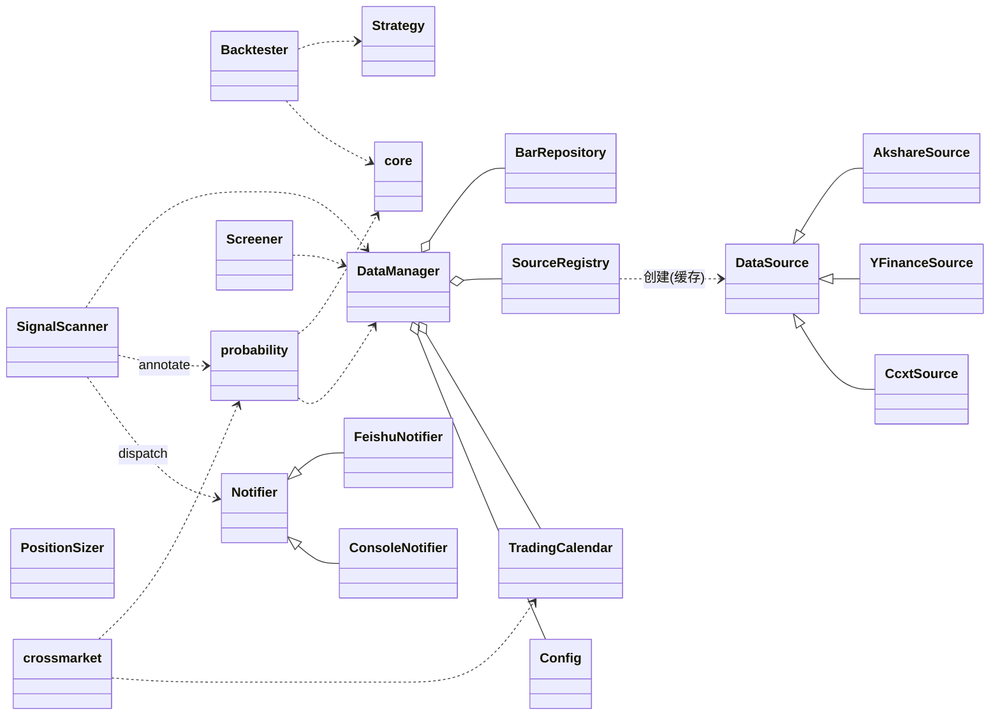
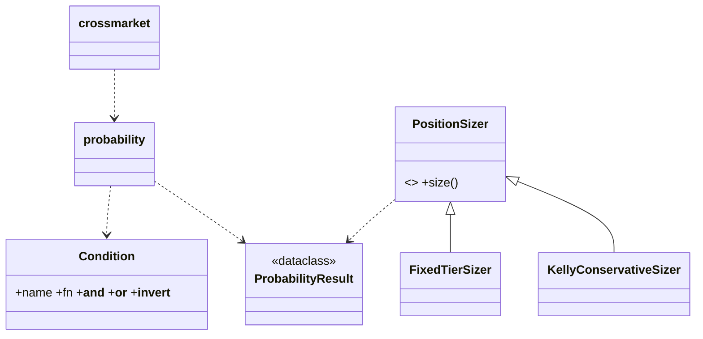
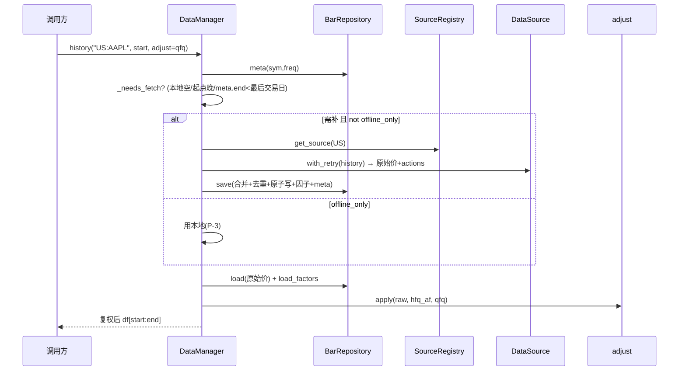
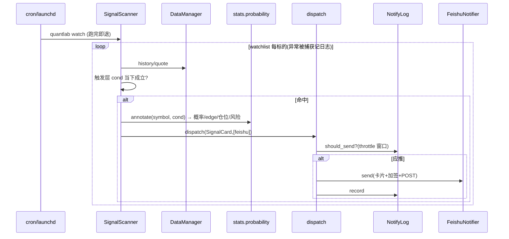

# QuantLab 详细设计

| 项 | 内容 |
|----|------|
| 项目 | QuantLab —— 本地多市场股票/加密货币分析、统计概率信号与通知平台 |
| 版本 | v0.2（实现级） |
| 日期 | 2026-06-15 |
| 配套 | [需求文档.md](./需求文档.md) · [架构设计.md](./架构设计.md) |

> 本文把架构落到**可直接编码**的程度：类/属性/方法签名 + **关键方法的算法伪代码与公式** + 异常模型 + 关系图 + 数据流时序 + 完整 config/CLI/卡片示例。`★` 标核心。签名用 Python 类型标注表达；伪代码用 `≈Python`。

---

## 1. 文档约定

- 语言 Python ≥ 3.12；全程类型标注；不可变值对象用 `@dataclass(frozen=True)`。
- **列名常量**（`quantlab/constants.py`）：`OPEN, HIGH, LOW, CLOSE, VOLUME = "open","high","low","close","volume"`；指标列见 §8.1。
- **单位约定**：收益/概率/edge/仓位均为**小数**（0.015 = 1.5%）；`cost_bps` 为基点（5 = 0.05%）；MAE 为负的小数（-0.03 = 回撤 3%）。
- **DataFrame** 默认指标准 OHLCV（§13.1）；函数返回 DataFrame 默认满足该契约且 `index` 升序去重。
- 包根 `quantlab/`。三大**不变量**贯穿（§14）：无未来函数、离线可复现、复权纯函数。

---

## 2. 异常与错误模型 (`quantlab/errors.py`)

```python
class QuantLabError(Exception): ...
class SymbolParseError(QuantLabError): ...      # "CN:" 格式错
class SourceUnavailable(QuantLabError): ...     # 第三方库未装 / 源不支持该市场(缺库不崩, 捕获后跳过)
class FetchError(QuantLabError): ...            # 联网失败/限流 —— ★可重试
class DataQualityError(QuantLabError): ...      # 校验失败且无法修复
class InsufficientData(QuantLabError): ...      # 历史/样本不足以计算
class NotifyError(QuantLabError): ...           # 推送失败(单通道失败不影响其它通道)
```

**重试策略**（M2 落地，接口先定）：

```python
def with_retry(fn, *, retries=3, backoff=1.5, on=(FetchError,)):
    # 指数退避; 仅包 FetchError; 耗尽后抛出, 由 watch 记入 run 日志(不崩整轮)
```

**传播原则**：`SourceUnavailable` 在 registry/适配器处被捕获并降级（缺库不崩）；`FetchError` 经 `with_retry`；`watch` 单标的异常被捕获并记日志，不中断整轮扫描。

---

## 3. 类总览（跨层关系）



---

## 4. 基础层

### 4.1 枚举 (`enums.py`)

```python
class Market(str, Enum):          CN="CN"; US="US"; HK="HK"; CRYPTO="CRYPTO"
class InstrumentType(str, Enum):  STOCK="stock"; ETF="etf"; INDEX="index"; CRYPTO="crypto"; UNKNOWN="unknown"
class Adjust(str, Enum):          RAW="raw"; QFQ="qfq"; HFQ="hfq"
class Freq(str, Enum):            DAY="1d"; WEEK="1w"; MONTH="1M"; HOUR="1h"; MIN="1m"
```

### 4.2 `Symbol`（`symbols.py`）

```python
@dataclass(frozen=True)
class Symbol:
    market: Market
    code: str
    instrument_type: InstrumentType = InstrumentType.UNKNOWN

    @classmethod
    def parse(cls, s: str) -> "Symbol":
        # 算法: 按第一个 ":" 切分; 左侧大写匹配 Market(否则 SymbolParseError);
        #       右侧为原生 code(保留原样, 如 "BTC/USDT"); type 暂留 UNKNOWN
    @property
    def key(self) -> str: ...                 # f"{market}:{code}"
    def with_type(self, t) -> "Symbol": ...
```

**`infer_instrument_type(market, code, source_hint=None) -> InstrumentType`** 判定规则：

| 市场 | 规则 |
|------|------|
| CN | code 前缀 `51/56/58`(沪)、`15`(深，常见 `159`) → ETF；`000300/399xxx` 等已知指数清单 / `source_hint=index` → INDEX；否则 STOCK |
| US | 优先 `source_hint`（yfinance `quoteType`：EQUITY→STOCK, ETF→ETF, INDEX→INDEX）；`^` 前缀 → INDEX |
| HK | 同 CN 规则的港股版（清单/源标志） |
| CRYPTO | 恒为 CRYPTO |

> 判定结果由 `DataManager.download` 富化并写入 `bars_meta.instrument_type`，后续从库读取，不每次重算。

### 4.3 `Config`（`config.py`）

```python
@dataclass
class SizingConfig: method: str="fixed_tier"; max_position: float=0.5; kelly_fraction: float=0.3
@dataclass
class NotifyConfig: channels: list[str]; feishu: dict; throttle_minutes: int=30
@dataclass
class Config:
    data_root: str="data/"
    offline_only: bool=False
    adjust_default: Adjust=Adjust.QFQ
    markets: dict[Market, dict]
    watchlists: dict[str, list[Symbol]]
    sizing: SizingConfig
    notify: NotifyConfig
    stats_min_samples: int=30
    retry: dict=...                                # {retries, backoff}

    @classmethod
    def load(cls, path="config.yaml") -> "Config":
        # 读 yaml → 递归把 "${VAR}" 替换成 os.environ["VAR"](缺则报错) → 构造 dataclass
```

### 4.4 `TradingCalendar`（`calendar.py`）

```python
class TradingCalendar:
    # 懒加载 exchange_calendars(可选); 缺库时回退到"工作日近似 + 内置节假日表"
    def last_trading_day(self, market, asof=None) -> date
    def is_trading_day(self, market, d) -> bool
    def sessions(self, market, start, end) -> DatetimeIndex
    def align(self, lead: Market, target: Market, lag=1) -> "Series[date->date]":
        # 算法: 对 target 每个交易日 d, 取 lead 在 d 之前(含跨夜)已收盘的第 lag 个 session
        #       美股 day-T 收盘(美东16:00 ≈ 北京次日04:00) 在 A股 day-(T+1) 开盘前 → 信息可用
```

### 4.5 `core` ★（共享时序原语，`stats`+`backtest` 共用、共测）

```python
def forward_return(df, n=1, price=CLOSE) -> Series:
    return df[price].shift(-n) / df[price] - 1.0     # 末 n 行 NaN; 唯一的"前向"实现处

def mae(df, n, side="long") -> Series:
    # 每个 t: 前向 [t+1, t+n] 窗口内相对 df.close[t] 的最不利波动
    # long: min(low[t+1..t+n])/close[t]-1 (≤0)
    roll_min = df[LOW].shift(-1).rolling(n).min()    # 实现按窗口对齐, 见测试
    return roll_min / df[CLOSE] - 1.0

def shift_next_day(positions: Series) -> Series:
    return positions.shift(1).fillna(0.0)            # 信号次日生效, 防未来函数

def wilson_interval(k: int, n: int, z=1.96) -> tuple[float,float]:
    if n == 0: return (nan, nan)
    p = k/n
    c = (p + z*z/(2*n)) / (1 + z*z/n)
    h = z/(1 + z*z/n) * sqrt(p*(1-p)/n + z*z/(4*n*n))
    return (max(0,c-h), min(1,c+h))
```

---

## 5. 数据源层 (`datasources/`)

### 5.1 数据结构

```python
@dataclass
class Quote:
    symbol: Symbol; price: float; time: datetime
    prev_close: float|None=None; change_pct: float|None=None
    source: str=""; note: str=""
@dataclass
class HistoryResult:
    bars: DataFrame                       # 标准 OHLCV(原始价)
    actions: DataFrame|None=None          # index=date, cols=[dividend, split]; 无则 None
```

### 5.2 `DataSource`（ABC）

```python
class DataSource(ABC):
    markets: ClassVar[list[Market]]
    name: ClassVar[str]
    @abstractmethod
    def history(self, sym, start, end, freq) -> HistoryResult: ...
    @abstractmethod
    def quote(self, sym) -> Quote: ...
    def _normalize(self, raw) -> DataFrame: ...     # 见 5.3
```

### 5.3 `_normalize` 校验/清洗规则（每个源都要过）

```
1. 列名 → open/high/low/close/volume; 类型 → float64
2. index → DatetimeIndex(name="date", tz-naive), 升序, 去重(keep=last)
3. 丢弃坏行: 任一 OHLC 为 NaN/≤0, 或 high<low  → drop + 计数(超阈值 raise DataQualityError)
4. 停牌: volume==0 → 标记; 默认保留(OHLC 前向填充为前一 close), 可配置丢弃
5. 返回原始价(不复权); 复权事件单独放 HistoryResult.actions
```

### 5.4 三个适配器（懒加载 + 各自坑）

| 类 | markets | history 要点 | quote 要点 |
|----|---------|-------------|-----------|
| `AkshareSource` | CN, HK | `ak.stock_zh_a_hist(adjust="")` 取**不复权**原始价；分红送配单独接口拼 `actions`（不用 ak 的 qfq，避免缝合） | 全市场快照表查一行（OPT-4 待优化为缓存） |
| `YFinanceSource` | US, HK | `yf.Ticker.history(auto_adjust=False, actions=True)` 直接给 raw + dividends/splits | `fast_info`/最近收盘（~15min 延迟） |
| `CcxtSource` | CRYPTO | `exchange.fetch_ohlcv(symbol, timeframe)`；无复权（actions=None） | `fetch_ticker`（近实时） |

- 每个源方法内 `import` 第三方库；`ImportError` → `raise SourceUnavailable`。
- 联网异常 → `raise FetchError`（交给 `with_retry`）。

### 5.5 `SourceRegistry`

```python
class SourceRegistry:
    def __init__(self, config): self._cfg=config; self._cache={}
    def get_source(self, market) -> DataSource:
        # 查 config.markets[market] 决定源类; 实例缓存; 懒构建; 缺库 → SourceUnavailable
```

---

## 6. 存储层 (`storage/repository.py`)

```python
@dataclass
class BarMeta:
    symbol: str; freq: str; start: date; end: date
    rows: int; source: str; instrument_type: str; updated_at: datetime

class BarRepository:
    def __init__(self, root="data/"): ...
    def load(self, sym, freq) -> DataFrame: ...          # 无文件 → 空 df(列齐全)
    def load_factors(self, sym) -> DataFrame: ...
    def meta(self, sym, freq) -> BarMeta|None: ...
    def catalog(self) -> list[BarMeta]: ...
    def save(self, sym, freq, bars, actions): ...        # 算法见下
```

**`save` 合并算法（幂等、原子）**：

```
existing = load(sym, freq)
merged   = concat([existing, bars]).sort_index()
merged   = merged[~merged.index.duplicated(keep="last")]   # 新数据覆盖旧
_atomic_write_parquet(path, merged)                        # 写 tmp → os.replace(原子)
if actions: 同法 upsert data/adjust/<m>/<code>.parquet
upsert bars_meta(start=merged.index[0], end=merged.index[-1],
                 rows=len(merged), source, instrument_type, updated_at=now())
```

> 原子写（tmp+replace）保证中断不产生半截文件 → 支撑离线复现。

---

## 7. 编排层

### 7.1 `adjust.py`（复权纯函数）★

```python
def compute_factors(actions: DataFrame, raw: DataFrame) -> Series:
    # 每个除权除息日 t 的"当日因子" g_t:
    #   现金分红 D:  g_t = C_prev / (C_prev - D)        # C_prev = 除权前一日 close
    #   拆股(1→k):   g_t *= k
    # 后复权因子 hfq_af[t] = ∏_{s<=t} g_s   (从前往后累乘, 早期≈1)
    # 返回 hfq_af(对齐到 raw.index, 无事件处 ffill)

def apply(raw: DataFrame, hfq_af: Series, mode: Adjust) -> DataFrame:
    if mode == RAW:  return raw
    if mode == HFQ:  af = hfq_af
    if mode == QFQ:  af = hfq_af / hfq_af.iloc[-1]        # 归一: 最新=1 → 最新≈原始价
    out = raw.copy()
    out[[OPEN,HIGH,LOW,CLOSE]] *= af.values[:,None]       # volume 不调
    return out
```

> 纯函数、无副作用；新数据到来 `hfq_af` 早期值不变（qfq 仅整体重新归一），历史**不缝合**。

### 7.2 `DataManager` ★（`data_manager.py`）

```python
class DataManager:
    def __init__(self, config, repo, registry, calendar): ...

    def history(self, symbol, start=None, end=None, freq=Freq.DAY, adjust=None) -> DataFrame:
        sym = Symbol.parse(symbol) if str else symbol
        adjust = adjust or self.cfg.adjust_default
        meta = self.repo.meta(sym, freq)
        if self._needs_fetch(meta, start, end, sym.market) and not self.cfg.offline_only:
            res = with_retry(lambda: self.registry.get_source(sym.market).history(sym,start,end,freq))
            self.repo.save(sym, freq, res.bars, res.actions)
        raw = self.repo.load(sym, freq)
        if freq in (WEEK, MONTH): raw = _resample(raw, freq)      # 日线为唯一真相, 周/月重采样
        out = adjust_mod.apply(raw, self.repo.load_factors(sym), adjust) if 股票类 else raw
        return _slice(out, start, end)

    def _needs_fetch(self, meta, start, end, market) -> bool:
        if meta is None: return True
        if start and meta.start > to_date(start): return True
        if meta.end < self.calendar.last_trading_day(market): return True
        return False

    def quote(self, symbol) -> Quote:
        if self.cfg.offline_only:
            return Quote(sym, price=last_local_close, ..., note="offline: 最近本地收盘")
        return self.registry.get_source(market).quote(sym)        # 实时统一 qfq 口径见 §架构8

    def download(self, symbols, start=None, end=None, freq=Freq.DAY) -> list[BarMeta]:
        # 批量: 逐个 history()(强制拉取并落库) + 富化 instrument_type; 失败计入结果不中断
        # (并发 ThreadPoolExecutor 为 OPT-3, M1 串行)

    def catalog(self) -> list[BarMeta]: return self.repo.catalog()
```

### 7.3 装配 `bootstrap.py`（依赖注入入口）

```python
def build_app(config_path="config.yaml") -> DataManager:
    cfg = Config.load(config_path)
    return DataManager(cfg, BarRepository(cfg.data_root), SourceRegistry(cfg), TradingCalendar())
```

> CLI、dashboard、notebook 都用 `build_app()` 取 `DataManager`，再自行构造功能层对象。

---

## 8. 功能层

### 8.1 指标 (`indicators/technical.py`)

```python
def ma(s,n)->Series; ema(s,n); rsi(s,n=14); atr(df,n=14)
def macd(s,fast=12,slow=26,signal=9)->DataFrame   # cols: macd, macd_signal, macd_hist
def boll(s,n=20,k=2)->DataFrame                    # cols: boll_mid, boll_up, boll_low

def add_indicators(df, spec: list[str]|None=None) -> DataFrame:
    # 默认 spec=["ma5","ma20","ema12","rsi14","macd","boll","atr14"]
    # 追加列(不改原列): ma5,ma20,ema12,rsi14,macd,macd_signal,macd_hist,boll_mid/up/low,atr14
    # 薄封装: 内部可走 pandas-ta(装了)否则自研; 第三方类型不外漏(NFR-6)
```

### 8.2 回测 (`backtest/`)

```python
class Strategy(ABC):
    @abstractmethod
    def generate_positions(self, df) -> Series: ...     # 目标仓位 ∈ [0,1]
class DualMAStrategy(Strategy):       # fast 上穿 slow → 1, 下穿 → 0
    def __init__(self, fast=5, slow=20)
class RsiReversionStrategy(Strategy):  # rsi<low → 1, rsi>high → 0
    def __init__(self, period=2, low=10, high=90)

@dataclass
class BacktestResult:
    equity_curve: Series; returns: Series; buy_hold: Series
    total_return: float; cagr: float; vol: float; sharpe: float
    max_drawdown: float; n_trades: int
    def tearsheet(self): ...                            # 薄封装 quantstats(装了才用)

class Backtester:
    def __init__(self, cost_bps=5.0): ...
    def run(self, df, strategy) -> BacktestResult:
        pos  = strategy.generate_positions(df).clip(0,1)
        pos  = shift_next_day(pos)                       # ★次日生效
        r    = df[CLOSE].pct_change().fillna(0)
        cost = pos.diff().abs().fillna(pos.abs()) * self.cost_bps/1e4
        ret  = pos*r - cost
        eq   = (1+ret).cumprod()
        # 指标:
        #   total_return = eq.iloc[-1]-1
        #   cagr  = eq.iloc[-1]**(252/len(eq)) - 1
        #   vol   = ret.std()*sqrt(252)
        #   sharpe= ret.mean()/ret.std()*sqrt(252)        (ret.std()==0 → 0)
        #   max_drawdown = (eq/eq.cummax()-1).min()
        #   n_trades = (pos.diff()!=0).sum()
        #   buy_hold = (1+r).cumprod()
```

### 8.3 统计概率引擎 (`stats/`) ★产品核心



**`conditions.py` —— 可组合谓词**

```python
@dataclass
class Condition:
    name: str
    fn: Callable[[DataFrame], Series]               # df → bool Series(对齐 index)
    def __call__(self, df): return self.fn(df).fillna(False)
    def __and__(self, o): return Condition(f"({self.name} & {o.name})", lambda d: self(d)&o(d))
    def __or__(self, o):  return Condition(f"({self.name} | {o.name})", lambda d: self(d)|o(d))
    def __invert__(self): return Condition(f"~{self.name}", lambda d: ~self(d))

def drop_gt(pct)   -> Condition   # close.pct_change() < -pct
def n_down_days(n) -> Condition   # 连续 n 天 close.pct_change()<0
def rsi_lt(t,n=14) -> Condition   # rsi(close,n) < t  (内部 add_indicators)
def vol_spike(k=2.0)-> Condition  # volume > k * volume.rolling(20).mean()
```

**`probability.py` ★**

```python
@dataclass
class ProbabilityResult:
    condition: str; symbol: str; forward: int
    n: int; p_up: float; base_rate: float; edge: float       # ★ edge = p_up - base_rate
    ci_low: float; ci_high: float                            # ★ Wilson(p_up)
    mean_ret: float; median_ret: float; payoff: float; mae: float
    reliable: bool                                           # n >= min_samples

def probability(df, cond, forward=1, min_samples=30) -> ProbabilityResult:
    fwd  = forward_return(df, forward)                       # core
    valid= fwd.notna()
    base = (fwd[valid] > 0).mean()                           # 无条件基准率
    mask = cond(df) & valid
    f    = fwd[mask]
    n    = int(mask.sum())
    if n == 0: raise InsufficientData
    p_up = (f > 0).mean()
    win  = f[f>0].mean(); loss = f[f<0].mean()
    payoff = abs(win/loss) if loss else inf
    mae_  = mae(df, forward)[mask].mean()
    lo,hi = wilson_interval(int((f>0).sum()), n)
    return ProbabilityResult(cond.name, ..., n, p_up, base, p_up-base, lo, hi,
                             f.mean(), f.median(), payoff, mae_, n>=min_samples)
```

**`crossmarket.py`**

```python
def crossmarket(dm, lead, target, cond, forward=1, calendar=...) -> ProbabilityResult:
    lead_df = dm.history(lead); tgt_df = dm.history(target)
    amap    = calendar.align(market(lead), market(target), lag=1)   # A股日→前一已收盘美股session
    # 把 lead 的 cond 命中映射到 target 对应交易日, 再用 target 的 forward_return 统计
    # 复用 probability 的 base/edge/Wilson 逻辑(条件来自 lead, 收益来自 target)
```

**`sizing.py`**

```python
class PositionSizer(ABC):
    max_position: float
    @abstractmethod
    def size(self, r: ProbabilityResult) -> float: ...
    def _guard(self, r): return r.reliable and r.edge > 0          # 无优势/不可靠 → 0

class FixedTierSizer(PositionSizer):
    # if not _guard: 0; elif p_up>=0.70: 0.5; >=0.65: 0.3; >=0.60: 0.1; else 0
    # 再 min(max_position)
class KellyConservativeSizer(PositionSizer):
    # if not _guard: 0
    # b=r.payoff; p=r.p_up; q=1-p; f=(b*p-q)/b
    # return clip(f*kelly_fraction, 0, max_position)
```

### 8.4 选股 (`screener/`)

```python
@dataclass
class Rule: name: str; applicable_types: set[InstrumentType]; fn: Callable[[DataFrame],bool]
@dataclass
class ScreenHit: symbol: str; matched: list[str]; skipped: list[str]

class Screener:
    def __init__(self, dm): ...
    def run(self, symbols, rules) -> list[ScreenHit]:
        # 逐 symbol: df=add_indicators(dm.history(s))
        #   对每 rule: 若 sym.instrument_type ∉ rule.applicable_types → skipped(不判负)
        #              else 评估 rule.fn(df) → matched/未命中
        #   全部 applicable rule 命中 → 收入结果
```

### 8.5 盯盘信号 (`signals/`)

```python
@dataclass
class SignalRule: name: str; kind: str; cond: Condition          # kind ∈ {buy, sell}
@dataclass
class Signal: symbol: str; rule: SignalRule; asof: datetime

class SignalScanner:                                  # 触发层
    def __init__(self, dm, rules): ...
    def scan(self, watchlist) -> list[Signal]:
        # 逐标的 df=add_indicators(dm.history(s)); 对每 rule: cond(df).iloc[-1] 为真 → Signal
```

### 8.6 ML (`ml/`) — M3 扩展位

```python
class Predictor(ABC):
    def fit(self, X, y): ...
    def predict(self, X) -> Series: ...
    def evaluate(self, X, y) -> dict: ...     # 报相对多数类基准的超额(诚实评估)
```

---

## 9. 出口层 (`notify/`)

```python
@dataclass
class SignalCard:
    symbol: str; condition: str; kind: str            # buy/sell/warn
    p_up: float; base_rate: float; edge: float; ci: tuple[float,float]
    n: int; suggested_position: float; risk_mae: float
    time: datetime; extra: dict = field(default_factory=dict)
    @property
    def dedup_key(self) -> str: return f"{self.symbol}|{self.condition}|{self.kind}"

class Notifier(ABC):
    @abstractmethod
    def send(self, card) -> bool: ...

class FeishuNotifier(Notifier):
    def __init__(self, webhook, secret=None): ...
    def _sign(self, ts: int) -> str:
        s = f"{ts}\n{self.secret}"
        return base64.b64encode(hmac.new(s.encode(), b"", hashlib.sha256).digest()).decode()
    def _build_card(self, c) -> dict: ...             # 见 §13.4 卡片 JSON
    def send(self, c) -> bool:
        body = {"msg_type":"interactive","card":self._build_card(c)}
        if self.secret: ts=int(time()); body |= {"timestamp":ts,"sign":self._sign(ts)}
        r = requests.post(self.webhook, json=body, timeout=5)
        # r.json()["code"]!=0 → raise NotifyError

class ConsoleNotifier(Notifier):                      # 默认, 打印
    def send(self, c) -> bool: print(format(c)); return True

class NotifyLog:                                      # SQLite 跨进程去重
    def should_send(self, card, window_min) -> bool:
        # SELECT max(sent_at) WHERE symbol,signal=dedup_key → now-last >= window_min
    def record(self, card): ...                       # INSERT

def dispatch(card, channels, cfg) -> None:
    for ch in channels:
        n = _registry[ch]
        if NotifyLog().should_send(card, cfg.throttle_minutes):
            try:
                if n.send(card): NotifyLog().record(card)
            except NotifyError: log.warning(...)      # 单通道失败不影响其它
```

---

## 10. 表现层

### 10.1 `viz/`（plotly, M2）

```python
def plot_candles(df, indicators=None) -> Figure        # 蜡烛 + 指标叠加
def plot_equity(result: BacktestResult) -> Figure       # 净值 + 回撤
def plot_probability(result: ProbabilityResult) -> Figure  # 前向收益分布 + p_up vs base_rate
```

### 10.2 CLI 命令规格 (`cli.py`, typer)

| 命令 | 参数 / 选项 | 调用 | 输出 | 里程碑 |
|------|------------|------|------|--------|
| `download` | `SYMBOLS...` `--start --end --freq` | `DataManager.download` | 每标的 BarMeta 表 | M1 |
| `quote` | `SYMBOL` | `DataManager.quote` | price/time/涨跌幅 | M1 |
| `backtest` | `SYMBOL` `--strategy --fast --slow --cost-bps` | `Backtester.run` | 指标表 + 对照 | M1 |
| `stats` | `SYMBOL` `--cond "drop_gt:1.5,n_down:2" --forward 1` | `stats.probability` | n/p_up/base/edge/CI/payoff/MAE | M1 |
| `crossmarket` | `LEAD TARGET` `--cond ... --forward` | `stats.crossmarket` | 同上(对齐后) | M2 |
| `screen` | `--watchlist NAME --rules ...` | `Screener.run` | 命中标的 + skipped | M2 |
| `watch` | `--watchlist NAME --channels feishu` | `SignalScanner`+`dispatch` | 推送 + 控制台摘要 | M2 |
| `catalog` | —— | `DataManager.catalog` | 本地数据目录表 | M1 |
| `dashboard` | —— | `streamlit run dashboard/app.py` | 启动看板 | M2 |

**`stats` 输出示例**：

```
US:^IXIC  条件=drop_gt(1.5%)&n_down_days(2)  forward=1
  样本 N=42   上涨概率 61.9%   基准率 53.1%   edge +8.8%   [95%CI 46.8%~75.2%]
  平均次日 +0.42%  中位 +0.35%  盈亏比 1.34  平均MAE -1.1%   可靠? 是
```

### 10.3 `dashboard/app.py`：Streamlit，调用同一功能层 + `viz`。

---

## 11. 配置 `config.yaml`（完整示例）

```yaml
data_root: data/
offline_only: false
adjust_default: qfq                    # raw | qfq | hfq
stats_min_samples: 30
retry: { retries: 3, backoff: 1.5 }

markets:                               # 市场 → 源 路由
  CN: { source: akshare }
  HK: { source: akshare }
  US: { source: yfinance }
  CRYPTO: { source: ccxt, exchange: kraken }   # Binance 451 → kraken

watchlists:                            # 主题标的池(个股 + ETF 混合)
  机器人:   [CN:159819, CN:300024]
  AI:       [US:QQQ, CN:159819]
  智能制造: [CN:516960]

sizing:
  method: fixed_tier                   # fixed_tier | kelly_conservative
  max_position: 0.5
  kelly_fraction: 0.3

notify:
  channels: [console]                  # 默认 console; 配好后加 feishu
  throttle_minutes: 30
  feishu:
    webhook: ${FEISHU_WEBHOOK}         # 走环境变量, 不入库/不进 git
    secret:  ${FEISHU_SECRET}
```

---

## 12. 数据流（时序）

### 12.1 `history()` 本地优先



### 12.2 条件概率统计（base_rate / edge / CI）★

```mermaid
sequenceDiagram
    participant C as CLI
    participant P as stats.probability
    participant DM as DataManager
    participant Core as core
    C->>P: probability(df, drop_gt(1.5%)&n_down_days(2), forward=1)
    P->>DM: history(sym, qfq) + add_indicators
    P->>Core: forward_return(df,1)
    Core-->>P: fwd
    P->>P: base=(fwd>0).mean(); mask=cond&valid; p_up=(fwd[mask]>0).mean()
    P->>Core: wilson_interval(k,n)
    P-->>C: ProbabilityResult{n,p_up,base,edge,ci,payoff,mae,reliable}
```

### 12.3 跨市场领先预警（美股→A股）

```mermaid
sequenceDiagram
    participant CM as stats.crossmarket
    participant DM as DataManager
    participant Cal as TradingCalendar
    CM->>DM: history("US:^IXIC") & history("CN:000300")
    CM->>Cal: align(US,CN,lag=1)
    Cal-->>CM: A股日→前一已收盘美股session
    CM->>CM: 对齐; mask=美股跌幅>1.5%; 统计 A股次日收益(复用 probability)
    CM-->>CM: ProbabilityResult(跟跌概率/edge/CI) → 盘前预警卡片
```

### 12.4 `watch` → 信号 → 标注 → 通知（cron 一次性）



### 12.5 回测

```mermaid
sequenceDiagram
    participant C as CLI
    participant B as Backtester
    participant S as Strategy
    participant Core as core
    C->>B: run(df, DualMAStrategy(5,20))
    B->>S: generate_positions(df)
    B->>Core: shift_next_day(pos)  (次日生效)
    B->>B: ret=pos*pct_change-cost; eq=cumprod; 算 cagr/sharpe/maxdd/buy_hold
    B-->>C: BacktestResult
```

---

## 13. Schema 汇总

### 13.1 标准 OHLCV DataFrame

```
index   : DatetimeIndex name="date", 升序, 去重, 无时区(各市场本地交易日)
columns : open, high, low, close, volume   float64    # 原始价
```

### 13.2 指标列（`add_indicators` 追加）

```
ma5, ma20, ema12, rsi14, macd, macd_signal, macd_hist,
boll_mid, boll_up, boll_low, atr14
```

### 13.3 Parquet 布局 + SQLite DDL

```
data/bars/<market>/<code>_<freq>.parquet     # 原始价(日线为唯一真相)
data/adjust/<market>/<code>.parquet          # 复权因子 hfq_af
data/quantlab.db                             # 见下
```

```sql
CREATE TABLE bars_meta (
  symbol TEXT, freq TEXT, start DATE, "end" DATE, rows INT,
  source TEXT, instrument_type TEXT, updated_at TIMESTAMP,
  PRIMARY KEY(symbol, freq));
CREATE TABLE etf_meta (
  symbol TEXT PRIMARY KEY, nav REAL, premium_discount REAL,
  tracking_index TEXT, theme TEXT, constituents TEXT);   -- theme/constituents = JSON
CREATE TABLE notify_log (
  symbol TEXT, signal TEXT, sent_at TIMESTAMP,
  PRIMARY KEY(symbol, signal, sent_at));
```

### 13.4 飞书消息卡片 JSON（`_build_card` 产出骨架）

```json
{
  "config": {"wide_screen_mode": true},
  "header": {"template": "red", "title": {"tag": "plain_text", "content": "⚠️ CN:000300 买入信号"}},
  "elements": [
    {"tag": "div", "fields": [
      {"is_short": true, "text": {"tag": "lark_md", "content": "**条件**\n跌幅>1.5% & 连跌2天"}},
      {"is_short": true, "text": {"tag": "lark_md", "content": "**上涨概率**\n61.9% (基准53.1%, edge +8.8%)"}},
      {"is_short": true, "text": {"tag": "lark_md", "content": "**样本/CI**\nN=42, 95%CI 46.8%~75.2%"}},
      {"is_short": true, "text": {"tag": "lark_md", "content": "**建议仓位/风险**\n30%, MAE -1.1%"}}
    ]},
    {"tag": "note", "elements": [{"tag": "plain_text", "content": "仅供参考, 非投资建议 · 2026-06-15"}]}
  ]
}
```

---

## 14. 关键不变量 + 单元测试清单

| 不变量 | 守在哪 | 测试用例(合成数据, 离线) |
|--------|--------|--------------------------|
| **无未来函数** | `core.forward_return` / `shift_next_day` 唯一实现 | 构造 `close=[1,2,3,4]`，断言 `forward_return(n=1)=[1,.5,.33,NaN]`；断言 backtest 用的是 `shift(1)` 仓位 |
| **离线可复现** | `DataManager._needs_fetch` | `FakeDataSource`(计数)：本地命中→0 次联网；`offline_only`→恒 0 次；缺口→1 次 |
| **复权纯函数** | `adjust.apply` | 给定原始价+一次分红，断言 qfq 最新价==原始最新价、hfq 首日==原始首日；追加新日后早期 hfq 不变 |
| **edge 透明** | `probability` + `PositionSizer` | `edge<=0` 或 `n<min` → `size()==0`；`p_up` 与 `wilson` 数值核对 |
| **数据校验** | `_normalize` | 注入 `high<low`/NaN/0量 行，断言被丢弃或标记 |
| **通知去重** | `NotifyLog.should_send` | 同 `dedup_key` 在 window 内第二次 → False；超窗 → True |
| **跨市场对齐** | `calendar.align` | 构造错峰日历，断言 A股 T 映射到美股 T-1 已收盘 session，无前视 |

> 测试优先级：先锁 **无未来函数** 和 **离线可复现**（错了产品不可信），再覆盖复权与概率数值。
