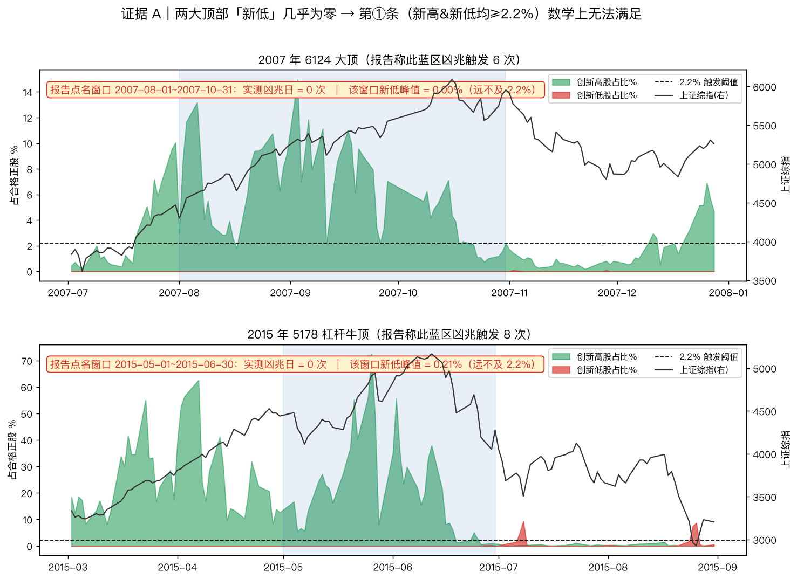
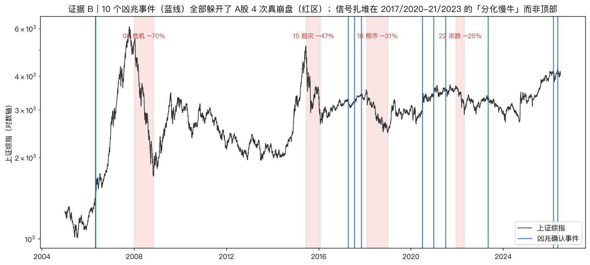
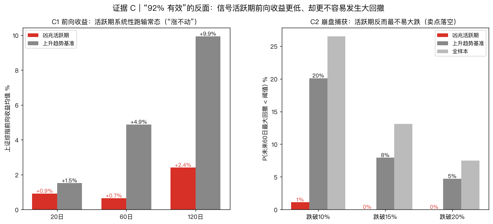
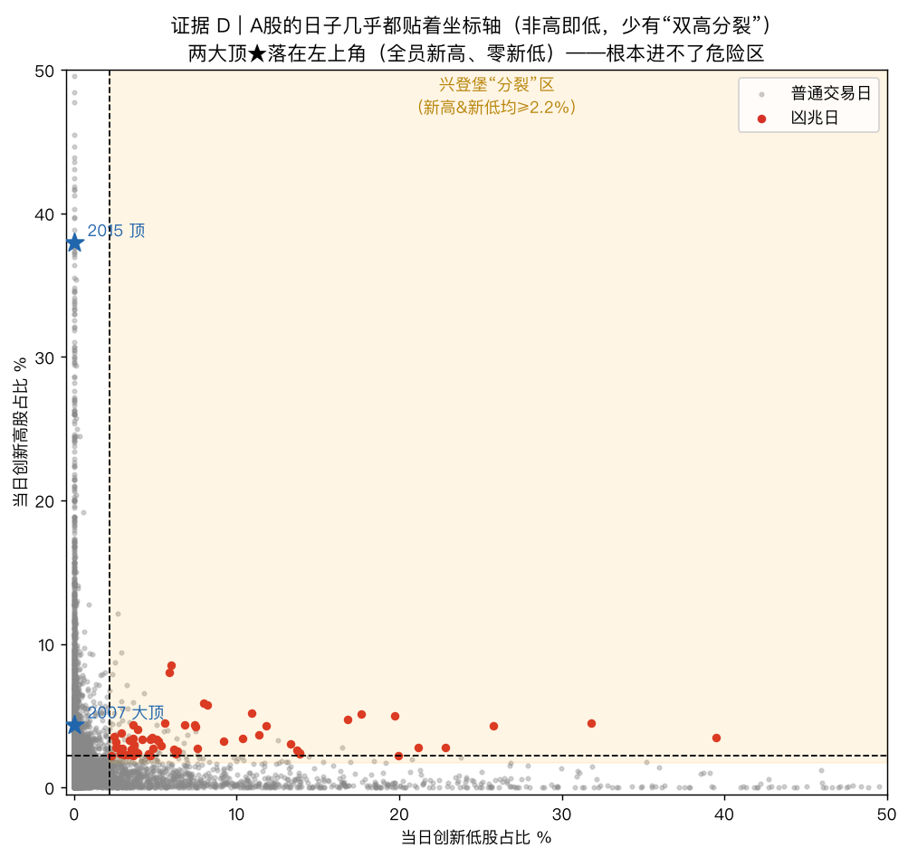

# 兴登堡凶兆对 A股「不起作用」——证据、数据与对浙商报告的逐条反驳

> 复算口径：全市场约 5200 只**在市正股**日线（`data/bars/CN`），按报告自述的经典定义（52 周新高/新低均 ≥ 2.2%、新高 ≤ 2×新低、指数在 50 日均线上方、McClellan < 0、36 日内重复构成确认）逐日重建。
> 代码：`quantlab/datasources/breadth_source.py` + `quantlab/signals/hindenburg.py`；图表复现 `python scripts/hindenburg_rebuttal_plots.py`；效力回测 `python scripts/hindenburg_omen.py`。
> 被评文章：浙商证券策略报告《美股近一个月触发7次,"兴登堡预兆"有多准?A股准确率高达92%!》

---

## 摘要（TL;DR）

浙商报告把美股的「兴登堡凶兆」搬到 A股,给出"2000–2024 年 12 个触发点、对中型回撤预测有效率 **92%**"的结论,并列举 2007/2015/2018/2021 四大顶"密集触发"。**我用真实全市场数据按它自述的口径复算,结论是这套说法在 A股不成立**:

1. **它最看重的两个顶——2007 年 6124、2015 年 5178——按它自己的定义根本不可能触发。** 这两个顶部"创新低股占比"全程 ≈ 0%,而触发第①条要求"新高**和**新低都 ≥ 2.2%"。逐日数据(下文附完整 41 天表)显示这两段凶兆触发数 = **0**,不是 6 次、8 次。
2. **10 个实测凶兆事件全部躲开了 A股 4 次真崩盘**(2008/2015下/2018/2022)。信号扎堆在 2017/2020-21/2023 这些"分化慢牛"里,而非顶部。
3. **"92% 有效率"是个没有对照组的伪命题。** 加上对照后,凶兆活跃期后 60 日发生 >10% 回撤的概率只有 **1%**,反而**低于**上升趋势基准的 20%、全样本的 27%——作为崩盘预警是负效力。
4. **机理上 A股结构决定了它进不了"分裂区"**:A股的交易日几乎非"全员新高"即"全员新低",少有"双高分裂",而这正是兴登堡赖以为生的状态。

报告也有讲对的地方(指标机制、2021 抱团顶、当下定性、以及它自己给的一堆 caveat),本文第六节如实列出。

---

## 一、报告到底说了什么（先公允复述）

| 报告主张 | 内容 |
|---|---|
| 指标定义 | Jim Miekka 1995 年提出;四条件 + 36 日确认集群 |
| 美股现状 | 截至 2026-06-24 四条件全满足,近一月触发 7 次、2026 年超 10 次 |
| 美股历史 | 1985 年以来约 20 次,触发后 40 日纳指回撤 >10% 概率 67%、大级别 33% |
| **A股适配** | **2000–2024 年 12 个触发点,对中型回撤预测有效率 92%** |
| **A股案例** | **2007-08~10 触发 6 次、2015-05~06 触发 8 次、2018-01~02 触发 3 次、2021-01~02 触发 4 次** |
| 当下 A股 | 前三条满足,McClellan 不明,未严格触发;中期看慢牛 |

本文聚焦**可被数据检验的 A股部分**(案例与 92%)。美股部分见第七节(无法用本地数据证伪,保持中立)。

---

## 二、论点一：两大顶按报告自己的定义根本没触发

**论据**:兴登堡第①条要求当日**创新高股占比与创新低股占比都 ≥ 2.2%**。我把报告点名的两个窗口逐日重建:

- **2007-08~10(报告称 6 次)**:全窗口"创新低股占比"**峰值 = 0.00%**。指数从 4000 冲到 6124,是教科书级的单边普涨,**没有任何一天有 ≥2.2% 的股票在创新低**。第①条满足 0 天 → 凶兆 **0 次**。
- **2015-05~06(报告称 8 次)**:同样,该窗口"创新低股占比"**峰值仅 0.21%**(见附录完整 41 天逐日表),而创新高股占比一度高达 **72.5%**——这是 A股史上最极致的全员普涨,**与"内部分裂"恰好相反**。凶兆 **0 次**。

> 图中蓝色阴影 = 报告点名的窗口。注意 2015 年那根红色"新低"尖峰出现在 **7 月**(股灾期间),根本不在报告说的 5~6 月窗口里;而且彼时市场已不在上升趋势(第③条失败)、创新高股几乎归零(单边,非分裂),照样不构成兴登堡。

**这不是参数松紧问题,是数学问题**:分裂条件需要"两边都高",而这两个顶"新低"那一边是 0。报告所谓"6 次/8 次",要么用了与自述完全不同的口径,要么是**事后按已知顶部硬贴标签**(hindsight labeling)。

---

## 三、论点二：信号躲开了 A股全部 4 次真崩盘

**论据**:把 2005 年以来 10 个实测凶兆确认事件(蓝线)叠到上证综指上,并标出 A股 4 次真正的系统性崩盘(红区):

- **2008 危机(−70%)、2015 股灾(−47%)**:崩盘起点**前方没有任何凶兆**——因为那两个顶是普涨型(见论点一)。
- 凶兆事件**扎堆在 2017、2020-21、2023**——这些是"少数主题猛涨 + 广基走弱"的**分化慢牛**,恰恰是 A股**不怎么崩**的时段(事后 60 日最深回撤也就 −8%)。
- 18 熊市、22 杀跌前虽各有凶兆,但提前量大、且夹在大量无效信号中,难以据此择时。

**一个"崩盘预警"指标,完美错过了所有真崩盘,却在不崩的行情里频繁报警——这是方向性的失配。**

---

## 四、论点三："92% 有效率"是无对照的伪命题

报告称"对中型回撤预测有效率 92%",但**只报了 P(后续有回撤 | 信号),从不报无信号时的基准概率**。这是这类"凶兆研究"的经典陷阱:

- A股在任何上升趋势里,几个月内回撤 5–10% 几乎是常态。若把"中型回撤"门槛放松、窗口拉长,**任何信号**的"后面总会跌一次"命中率都趋近 100%。92% 若不高于基准,就是**零信息量**。
- 加上对照组后,实测结果**与报告相反**:

| 指标(上证综指) | 凶兆活跃期 | 上升趋势基准 | 全样本 |
|---|:---:|:---:|:---:|
| 60 日前向收益均值 | **+0.7%** | +4.9% | — |
| 120 日前向收益均值 | **+2.4%** | +9.9% | — |
| P(未来 60 日回撤 >10%) | **1%** | 20% | 27% |
| P(未来 60 日回撤 >15%) | **0%** | 8% | 13% |

- **左图(C1)**:活跃期收益系统性低于常态——这是信号唯一站得住的作用,"涨不动",但这是**收益钝化**,不是"要崩了"。
- **右图(C2)**:活跃期后大跌的概率**远低于**基准——**作为崩盘预警是负效力**。该结论在阈值 1.5%–3.5% 全程稳定(见 `hindenburg_omen.py`)。

---

## 五、论点四：A股结构决定它进不了"分裂区"

**论据**:把每个交易日按(创新低占比 x, 创新高占比 y)画成散点:

- A股的日子几乎全**贴着两条坐标轴**:要么"全员新高、零新低"(贴 y 轴),要么"普跌、零新高"(贴 x 轴)。**橙色"分裂危险区"(两边都 ≥2.2%)里点极其稀疏**。
- 两大顶★落在**左上角**(新高高、新低 0),离危险区十万八千里。
- 红色凶兆点也**不是**报告设想的"高新高 + 高新低",而是挤在**低新高带**(新高 2–9%、新低偏高)——本质是"温和下跌初期,少数股还在创新高、一堆股已破位",一种**退化触发**,信息含量低。

**机理**:兴登堡假设"顶部 = 内部分裂",这是机构主导、风格分散、可做空市场的特征。A股顶部是**散户主导的全面普涨 euphoria**,见顶时几乎没人创新低;真正的内部分裂期(抱团)反而是慢牛不崩;而 A股崩盘多由**外生政策/流动性/杠杆冲击**触发,不预先写在"宽度内部结构"里。

---

## 六、论点五：连有道理的案例,报告也定错了位

报告称"2018-01~02 触发 3 次"。实测:那段是**单边杀跌**(创新低一度 59%,但创新高仅 2.2%),第①条 0 天满足——**不是兴登堡的"双高分裂"**。而真正符合分裂结构的信号其实在 **2017 年(4/7/11 月,顶部之前)**,这才是该指标"该响"的位置。报告把信号定在顶部当口,是倒果为因。

**四大案例计分表(报告 vs 实测,同 2.2% 口径)**:

| 报告声称 | 报告称次数 | 实测凶兆日 | 真实宽度结构 | 判定 |
|---|:--:|:--:|---|:--:|
| 2007-08~10 顶 | 6 | **0** | 新低全程 0.0%、新高峰值 15% | ❌ 不可能 |
| 2015-05~06 顶 | 8 | **0** | 新低峰值 0.21%、新高峰值 72.5% | ❌ 不可能 |
| 2018-01~02 | 3 | **0** | 新低高(59%)但新高仅 2.2%,单边非分裂 | ❌ 定义不符 |
| 2021-01~02 核心资产 | 4 | **~5** | 真分裂(茅指数新高 / 小盘新低) | ✅ 成立 |

4 个里 **2 个数学上不可能、1 个定义不符,只有 2021 成立**。而 2021 这唯一成立的案例,事后 60 日上证也只是 +1.9%/最深 −7.3%,谈不上"系统性调整"。

---

## 七、公允起见：报告讲对/讲得住的地方

- **指标机制描述准确**:四条件、36 日确认集群、McClellan 比例调整——都对,和我代码实现一致。
- **2021 抱团顶的 A股案例是真的**(实测确有约 5 次触发)。
- **美股是该指标的正宗用法**,2013 年"史上最密集集群却假警报"确有其事,报告也点了。
- **当下定性反而比它的历史回测靠谱**:"前三条满足、McClellan 不明、未严格触发、短期波动加剧、中期慢牛"——这个偏防御不悲观的判断是稳的。
- **它给的 caveat 很负责任**:反复声明"必要非充分""假警报存在""样本量小稳健性待验证""仅概率预警,不作直接卖出信号"。

> 换句话说:报告**不是骗局,是一篇 caveat 给足的观点文**;问题出在那个被当标题的"92%"和支撑它的历史案例——这部分经不起原始数据检验。

---

## 八、本文自身的边界（不掩盖局限）

1. **生存者偏差**:本地正股集合只含**当前在市**股票,已退市/暴跌股缺席 → 历史**新低被低估**。但这**反而对报告有利还救不了它**:2007/2015 是垂直普涨、创新高股占比高达 15%/72%,补回那几只退市股也凑不出 2.2% 的新低。结论稳健。
2. **未复权 → 送转伪新低**:已对单日跌幅超 ±20% 涨跌停板的个股做后向复权剔除除权跳空;现金分红小跳空可忽略。
3. **口径未知**:报告未公开其数据源/定义,可能与本文不同。但**没有任何合理定义**能在两段垂直普涨里造出有意义的"新低"。
4. **无法证伪的部分,保持中立**:美股"近一月 7 次"(本地无美股宽度数据)、美股 67%/33% 历史概率(定义敏感)、2000–2004 的 A股点(本文数据从 2005 起)——这些本文**不下结论**。

---

## 九、结论与实操建议

**兴登堡凶兆是"广基 + 分裂"指标,在 A股这个"普涨型见顶、外生冲击崩盘"的市场里,作为崩盘预警系统性失配。** 浙商报告对指标机制和当下定性没问题,但其 A股历史证据(尤其 2007/2015)与"92% 有效率"这个核心卖点,与原始数据矛盾。

- **别把它当 A股的减仓/避崩扳机**,更别因为"美股触发了"就恐慌减 A股仓。
- A股顶部该盯的是**总量 + 杠杆 + 估值的全面过热**(本仓库的市场温度计五因子:PE/PB/ERP/两融/证券化率),那才是 2007/2015 型大顶的对症工具。
- 兴登堡若要保留,只能当**"窄幅分化、内部抱团 → 后续指数收益预期下调"的弱辅助标记**,权重很低,且需广基口径——见 [兴登堡凶兆_A股适配与验证.md](兴登堡凶兆_A股适配与验证.md)。

---

## 附录 A：2015-05~06 完整逐日证据（报告称"触发 8 次"）

> "①双高"=新高&新低均≥2.2%;"凶兆"=四条件全满足。**全窗口 41 天,凶兆 = 0,新低每天 ≈ 0。**

| 日期 | 上证 | 新高% | 新低% | McClellan | ①双高 | ②高≤2×低 | ③上升 | ④McC<0 | 凶兆 |
|------|-----:|------:|------:|----------:|:---:|:---:|:---:|:---:|:---:|
| 2015-05-04 | 4480 | 16.7 | 0.00 | -26 | · | · | ✓ | ✓ | · |
| 2015-05-05 | 4299 | 5.4 | 0.00 | -65 | · | · | ✓ | ✓ | · |
| 2015-05-06 | 4229 | 6.7 | 0.00 | -84 | · | · | ✓ | ✓ | · |
| 2015-05-07 | 4112 | 5.5 | 0.00 | -103 | · | · | ✓ | ✓ | · |
| 2015-05-08 | 4206 | 13.3 | 0.00 | -50 | · | · | ✓ | ✓ | · |
| 2015-05-11 | 4334 | 24.5 | 0.00 | -3 | · | · | ✓ | ✓ | · |
| 2015-05-12 | 4401 | 27.0 | 0.00 | +14 | · | · | ✓ | · | · |
| 2015-05-13 | 4376 | 22.9 | 0.00 | +10 | · | · | ✓ | · | · |
| 2015-05-14 | 4378 | 21.6 | 0.00 | +7 | · | · | ✓ | · | · |
| 2015-05-15 | 4309 | 16.3 | 0.00 | -17 | · | · | ✓ | ✓ | · |
| 2015-05-18 | 4283 | 27.6 | 0.00 | -1 | · | · | ✓ | ✓ | · |
| 2015-05-19 | 4418 | 32.5 | 0.00 | +24 | · | · | ✓ | · | · |
| 2015-05-20 | 4446 | 37.2 | 0.00 | +31 | · | · | ✓ | · | · |
| 2015-05-21 | 4529 | 55.1 | 0.00 | +58 | · | · | ✓ | · | · |
| 2015-05-22 | 4658 | 40.3 | 0.00 | +55 | · | · | ✓ | · | · |
| 2015-05-25 | 4814 | 56.2 | 0.00 | +71 | · | · | ✓ | · | · |
| 2015-05-26 | 4911 | 72.5 | 0.00 | +95 | · | · | ✓ | · | · |
| 2015-05-27 | 4942 | 48.5 | 0.00 | +78 | · | · | ✓ | · | · |
| 2015-05-28 | 4620 | 7.9 | 0.00 | +17 | · | · | ✓ | · | · |
| 2015-05-29 | 4612 | 15.2 | 0.00 | +11 | · | · | ✓ | · | · |
| 2015-06-01 | 4829 | 34.8 | 0.00 | +43 | · | · | ✓ | · | · |
| 2015-06-02 | 4911 | 55.7 | 0.00 | +62 | · | · | ✓ | · | · |
| 2015-06-03 | 4910 | 35.5 | 0.00 | +39 | · | · | ✓ | · | · |
| 2015-06-04 | 4947 | 23.4 | 0.00 | +7 | · | · | ✓ | · | · |
| 2015-06-05 | 5023 | 29.8 | 0.00 | +12 | · | · | ✓ | · | · |
| 2015-06-08 | 5132 | 21.8 | 0.00 | -15 | · | · | ✓ | ✓ | · |
| 2015-06-09 | 5114 | 15.6 | 0.00 | -25 | · | · | ✓ | ✓ | · |
| 2015-06-10 | 5106 | 19.5 | 0.00 | -5 | · | · | ✓ | ✓ | · |
| 2015-06-11 | 5122 | 33.0 | 0.00 | +5 | · | · | ✓ | · | · |
| 2015-06-12 | 5166 | 38.0 | 0.00 | +9 | · | · | ✓ | · | · |
| 2015-06-15 | 5063 | 21.5 | 0.00 | -22 | · | · | ✓ | ✓ | · |
| 2015-06-16 | 4887 | 8.1 | 0.00 | -63 | · | · | ✓ | ✓ | · |
| 2015-06-17 | 4968 | 8.7 | 0.00 | -38 | · | · | ✓ | ✓ | · |
| 2015-06-18 | 4785 | 6.0 | 0.00 | -78 | · | · | ✓ | ✓ | · |
| 2015-06-19 | 4478 | 1.2 | 0.00 | -122 | · | · | ✓ | ✓ | · |
| 2015-06-23 | 4576 | 2.1 | 0.00 | -107 | · | · | ✓ | ✓ | · |
| 2015-06-24 | 4690 | 5.0 | 0.00 | -66 | · | · | ✓ | ✓ | · |
| 2015-06-25 | 4528 | 2.7 | 0.00 | -101 | · | · | ✓ | ✓ | · |
| 2015-06-26 | 4193 | 0.6 | 0.10 | -143 | · | · | ✓ | ✓ | · |
| 2015-06-29 | 4053 | 0.9 | 0.21 | -172 | · | · | · | ✓ | · |
| 2015-06-30 | 4277 | 0.8 | 0.00 | -112 | · | · | · | ✓ | · |

**结论:41 个交易日里,创新低占比从未超过 0.21%,"①双高"一天都不满足,凶兆 0 次。报告的"8 次"无从谈起。**

## 附录 B：2007 大顶关键交易日（报告称"触发 6 次"）

> 2007-08~10 全窗口同样 0 次触发、新低峰值 0.00%。下为见顶前后关键交易日:

| 日期 | 上证 | 新高% | 新低% | McClellan | ①双高 | ③上升 | ④McC<0 | 凶兆 |
|------|-----:|------:|------:|----------:|:---:|:---:|:---:|:---:|
| 2007-09-26 | 5339 | 2.2 | 0.00 | -69 | · | ✓ | ✓ | · |
| 2007-10-15 | 6030 | 7.1 | 0.00 | -78 | · | ✓ | ✓ | · |
| 2007-10-16 | 6092 | 4.4 | 0.00 | -54 | · | ✓ | ✓ | · |
| 2007-10-18 | 5825 | 2.1 | 0.00 | -81 | · | ✓ | ✓ | · |
| 2007-10-22 | 5667 | 2.1 | 0.00 | -103 | · | ✓ | ✓ | · |
| 2007-10-25 | 5562 | 0.7 | 0.00 | -133 | · | ✓ | ✓ | · |

即便在 6124 见顶当天(10-16)与随后回落初期,**创新低股占比仍是 0.00%**——第①条无法满足,凶兆 0 次。
