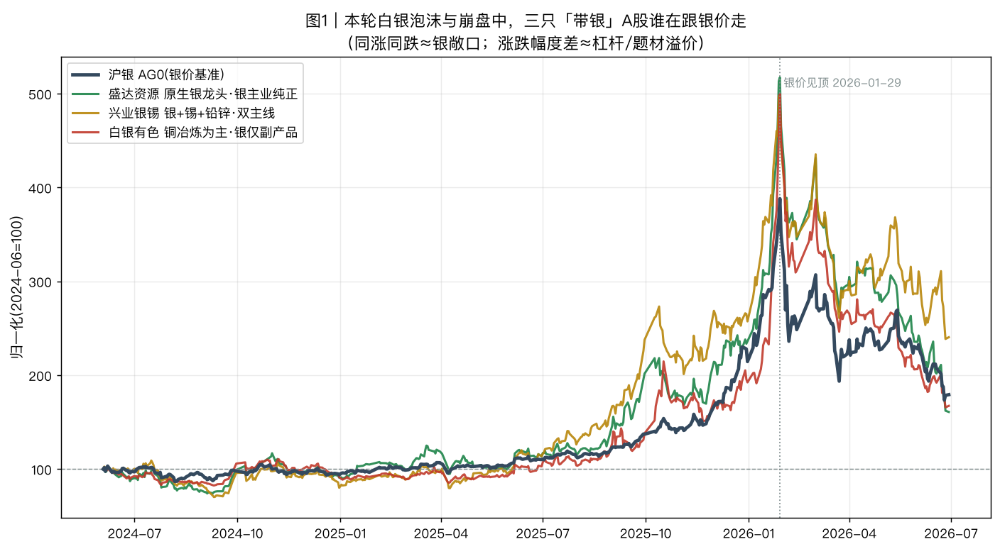
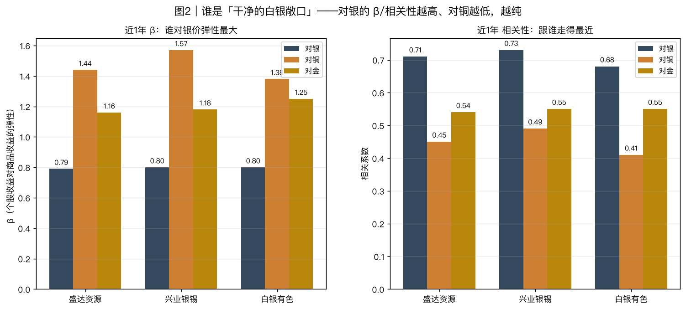
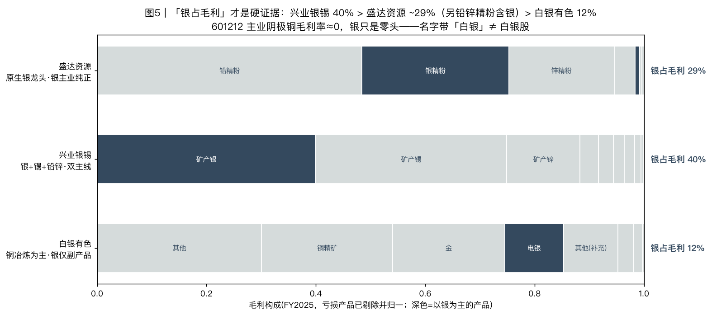
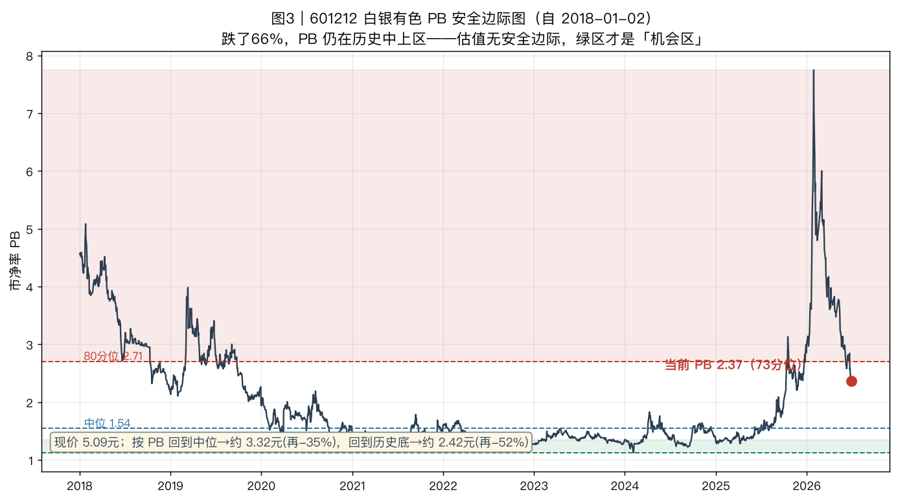
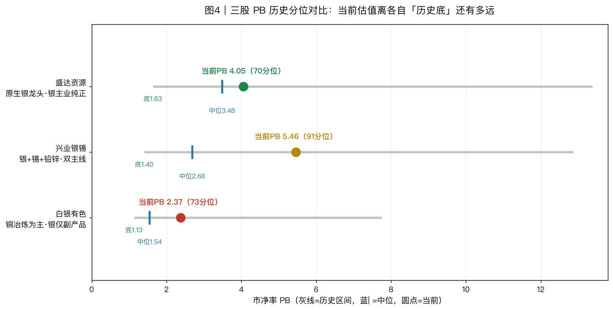
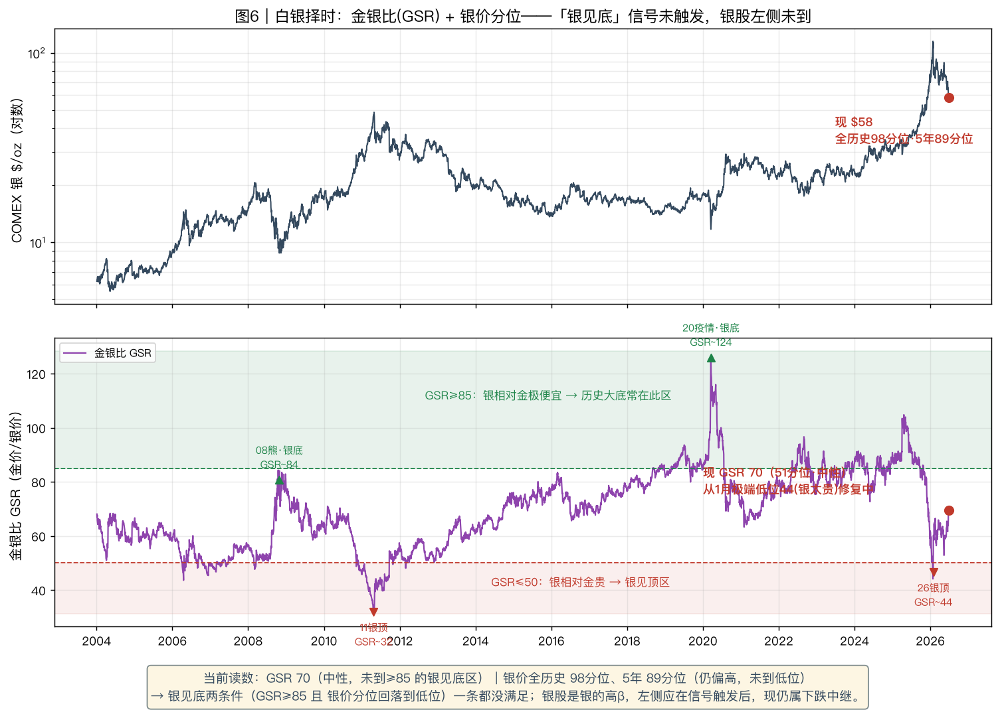

# 白银敞口对比与 601212 研判：谁才是干净的白银股，跌了一半还能抄底吗

> 数据日期：2026-06-29　|　数据源：akshare(个股前复权价/估值/主营构成)、Sina(沪银/沪铜/沪金主连)
> 复现脚本：`scripts/silver_exposure_compare.py`　|　配套：白银本身的泡沫-崩盘复盘见同目录《银价崩盘》对话与温度计研判

---

## 0. 结论先行（TL;DR）

1. **谁是干净的白银敞口？看毛利，不看名字。** 按 FY2025 银占毛利：**兴业银锡 40% > 盛达资源 ~29%(另铅锌精粉含银) > 白银有色 12%**。601212「白银」是甘肃**白银市**(地名)，主业是**毛利率≈0 的阴极铜冶炼**，银只是零头——**它根本不是白银股，是被题材当银炒的铜冶炼厂**。
2. **为什么 601212 比白银期货跌得更深(−66% vs 银 −54%)？** 因为它**涨得也比银猛**(本轮 +505%)，多出来的是「白银概念溢价」；银价腰斩时它丢的是「银 beta + 概念溢价 + 没有盈利地板」三杀。
3. **跌了一半，全都还不便宜。** 三只 PB 全部仍在自身历史**中上区**(盛达 70 分位 / **兴业 91 分位** / 601212 73 分位)。腰斩只是吐回疯涨，**估值没有进入「机会区」**。
4. **能否「入水建仓」？** 抄底的两个前提——①估值有安全边际(PB 近历史底)、②有明确催化(银价企稳)——**当前一个都不满足**，属于下跌中继、接飞刀。各股的左侧参考位见第 5 节。
5. **若一定要做多白银逻辑：** 选 exposure 更纯的 **盛达资源**(白银龙头、银为定价锚)或银占比最高的**兴业银锡**(但估值最贵、且被锡稀释)，**不要选 601212**——它既不是干净的银，论铜也有更好的标的。

> ⚠️ 本文是数据分析与框架，不构成投资建议；买卖决定与风险请自负。

---

## 1. 背景：本轮是一场白银抛物线泡沫 + 崩盘

白银(COMEX SI)2026-01-26 冲到 **$115/oz** 历史天价，1-30 单日 **−31%**(CME 上调保证金触发强平)，到 6 月底 $58，**自顶腰斩 −49%**；沪银同步从 30,891 元/kg 跌到 14,272(**−54%**)。三只「带银」A 股就是在这根抛物线上被一起炒上去、又一起摔下来的。

---

## 2. 三只标的本轮战绩：一起翻 6 倍，一起崩

| 标的 | 主业 | 本轮起点(2024低) | 顶点(日期) | 炒作涨幅 | 现价 | **自顶回撤** |
|---|---|---:|---:|---:|---:|---:|
| 盛达资源 000603 | 原生银龙头 | 9.67 | 67.51 (01-29) | **+598%** | 21.00 | **−68.9%** |
| 兴业银锡 000426 | 银+锡+铅锌 | 9.72 | 68.80 (01-28) | **+608%** | 33.27 | **−51.6%** |
| 白银有色 601212 | 铜冶炼为主 | 2.51 | 15.19 (01-29) | **+505%** | 5.09 | **−66.5%** |
| *沪银 AG0(对照)* | *银价本身* | *~8,800* | *30,891 (01-29)* | *~+250%* | *14,272* | *−54%* |

三只**顶点全部落在 2026-01-28/29**——和银价见顶同一周。**个股涨幅(5~6 倍)远大于银价(~2.5 倍)**，这多出来的部分就是股票的「杠杆 + 题材溢价」。

> 图1：以 2024-06=100 归一化。三条个股曲线与「沪银」几乎同涨同跌——**本轮市场把它们都当成白银 beta 在交易**；差别只在弹性大小。

---

## 3. 谁是干净的白银敞口？

### 3.1 一个陷阱：β/相关性几乎一样，区分不出来

| 标的 | β_银 | 相关_银 | β_铜 | 相关_铜 | β_金 | 相关_金 |
|---|---:|---:|---:|---:|---:|---:|
| 盛达资源 | 0.79 | 0.71 | 1.44 | 0.45 | 1.16 | 0.54 |
| 兴业银锡 | 0.80 | 0.73 | 1.57 | 0.49 | 1.18 | 0.55 |
| 白银有色 | 0.80 | 0.68 | 1.38 | 0.41 | 1.25 | 0.55 |

**反直觉点：三只对银的 β 几乎都是 0.80、相关性都在 0.7 上下，连「铜冶炼」的 601212 也是。** 这不是因为它们基本面银敞口相同，而是**近一年题材共振**——整个贵金属/白银概念主导了所有交易，掩盖了基本面差异。（注：β_铜 看着更高是因为铜波动率低、回归斜率被机械放大，相关性才是「跟谁走」的干净度量。）**所以光看价格统计区分不出谁纯，必须翻基本面。**

### 3.2 硬证据：银占毛利（FY2025）

| 标的 | **银占毛利** | 利润主来源(FY2025) | 定性 |
|---|---:|---|---|
| 兴业银锡 | **40%** | 矿产银40 + 矿产锡35 + 矿产锌13 | 银敞口**最大且显性**，但被锡稀释→「银+锡」双主线 |
| 盛达资源 | **~29%**(显性) | 铅精粉50(含银)+银精粉28+锌精粉20(含银) | 银/铅/锌一体，**银是综合定价锚**；含银精粉使实际银权重更高→市场认的**白银龙头** |
| 白银有色 | **12%** | 铜精矿26 + 金22 + 其他33 + **电银仅12**；阴极铜毛利≈0 | **银只是零头**，主业零毛利铜冶炼→**不是银股** |

**结论排序(白银敞口纯度)：**
- **想要「白银龙头」叙事最纯** → **盛达资源**(原生银、银为定价锚，市场公认的 A 股白银旗手)。
- **想要银占利润最高** → **兴业银锡**(银 40%)，但它同时是 35% 的**锡**，更像「白银 + 锡」组合，对纯银逻辑有稀释/对冲。
- **601212 白银有色** → **不该进白银股篮子**：银占毛利仅 12%，核心阴极铜还不赚钱，名字带「白银」纯属地名误会。

---

## 4. 601212 专题：为什么它不是银股、却比银期货跌得更深

把跌幅拆开看（个股 = 商品 β × 杠杆 + 概念溢价）：

1. **涨得比银多 → 跌得比银多。** 银价本轮 ~+250%，601212 +505%，多出来的是「白银概念」情绪溢价；溢价退潮时最先蒸发。
2. **经营杠杆。** 综合毛利率仅 **7.5%**(阴极铜业务毛利率几乎为 0)，是赚加工费的冶炼厂，金属价波动对利润是放大的。
3. **没有盈利地板。** TTM 净利为负(PE −67)、ROE≈0。15 块是纯情绪堆出来的，情绪一走没有 EPS 接力。
4. **A 股小盘题材的情绪 β**：题材退潮双向超调。

→ 银 −54%、601212 −66%，多跌的 12 个点就是**概念溢价 + 经营/财务杠杆 + 无盈利支撑**的代价。

---

## 5. 估值与安全边际：跌了一半，仍在历史中上区

### 5.1 601212 PB 温度计

> 现价 5.09 元、PB 2.37，仍处历史(2018 起)**73 分位**，在中位 1.54 **之上**，离历史底 1.13 还远。按 PB 回到中位→约 **3.32 元(再 −35%)**，回到历史底→约 **2.42 元(再 −52%)**。**绿区(PB≈1.1~1.3)才是有安全边际的「机会区」，现在不是。**

### 5.2 三股 PB 横向对比

| 标的 | 现价 | PB | 分位 | 历史底/中位 | →中位价(空间) | →历史底价(空间) |
|---|---:|---:|---:|---:|---:|---:|
| 盛达资源 | 21.00 | 4.05 | 70% | 1.63 / 3.48 | 18.0 (**−14%**) | 8.45 (**−60%**) |
| 兴业银锡 | 33.27 | **5.46** | **91%** | 1.40 / 2.68 | 16.4 (**−51%**) | 8.55 (**−74%**) |
| 白银有色 | 5.09 | 2.37 | 73% | 1.13 / 1.54 | 3.32 (**−35%**) | 2.42 (**−52%**) |

**三只全部仍在 PB 70~91 分位——腰斩只是把疯涨吐回去，估值层面没有一个便宜。** 其中 **兴业银锡最贵(91 分位)**，离自身历史底有 −74% 的理论空间；盛达离中位最近(−14%)但离底仍 −60%。

---

## 6. 能不能「入水建仓」？

**抄底 = 左侧买入，必须同时具备：①估值安全边际(PB 近历史底)　②明确催化(银价企稳/景气反转)。** 对照当前：

| 前提 | 盛达资源 | 兴业银锡 | 白银有色 |
|---|---|---|---|
| ① 估值安全边际 | ✗ PB 70 分位 | ✗ PB 91 分位(最贵) | ✗ PB 73 分位 |
| ② 催化(银价) | ✗ 银仍在下行/筑顶未完 | ✗ 同左 | ✗ 同左，且自身无盈利 |
| 银敞口纯度 | ◎ 最纯 | ○ 高但被锡稀释 | ✗ 仅 12%，非银股 |

**判断：** 现在三只都不满足左侧建仓标准，属于「跌了很多的下跌中继」，接飞刀。若按估值给**左侧参考观察位**（非买入建议，只是 PB 锚）：盛达回中位 ~18 元、兴业回中位 ~16 元、601212 回中位 ~3.3 元，才进入「估值不再贵」的区间；真正的安全边际要等 PB 逼近历史底(盛达 ~8.5 / 兴业 ~8.5 / 601212 ~2.4 元一带)。

**标的选择(若坚持做多白银)：**
- 要 exposure 干净 → **盛达资源**；要银占比最高 → **兴业银锡**(接受锡的稀释)。
- **避开 601212**：它不是银的纯敞口，论铜也有紫金矿业/江西铜业等更优标的。

---

## 7. 银的择时信号：金银比(GSR) + 银价分位——银股左侧何时到

银股是银价的**高 β**，所以「银股左侧」要等「银见底」先发生。判定银见底有两个互补条件：

1. **金银比 GSR 冲高到 ≥85**（银相对金极便宜）。历史大底几乎都在这区：2008 GFC GSR~84、2020 疫情 GSR~124，此后银都走出大行情；而 GSR≤50 是银见顶区（2011 GSR~32、**2026-01 GSR~44——这轮顶就在这**）。
2. **银价自身分位回落到低位**（绝对价不再贵）。

**当前读数：**
- GSR **69.5（51 分位，中性）**——刚从 1 月极端低位 44（银太贵）修复一半，**远未到 ≥85 的见底区**。
- 银价仍处**全历史 98 分位、5 年 89 分位**——腰斩后依然偏贵，**未到低位**。

→ **两个条件一个都没满足。** 银见底信号未触发，作为高 β 的银股(盛达/兴业)左侧也没到——与第 5 节 PB 分位结论一致：**现在是下跌中继，不是左侧。** 值得盯的触发：**GSR 上穿 ~85 且 银价分位跌进 30~40 以下**，那时银股的左侧机会才真正开始。

---

## 8. 一句话总结

> 这一轮是「白银概念」随银价泡沫破裂的**戴维斯双杀**。601212 名字带「白银」却是铜冶炼厂(银占毛利仅 12%)，所以它**既不是干净的银敞口、又因无盈利地板而比银期货跌得更深**。三只「带银」股腰斩后 PB 仍在历史 70~91 分位，**估值无安全边际、银价催化未现**——不符合左侧抄底标准。要做多白银逻辑，选盛达/兴业而非 601212；要抄底，等 PB 回到历史底部区。

---

## 附：数据与方法

- **价格**：akshare `stock_zh_a_daily`(前复权)；商品 Sina `futures_main_sina`(AG0/CU0/AU0 主连)。
- **估值**：东财 `stock_value_em`(PB/PE，历史自 2018-01)。**口径用 PB**——冶炼/矿企盈利随金属价大幅波动，PE 失真，PB 更稳。
- **主营构成**：东财 `stock_zygc_em`，按产品分类 FY2025；「银占毛利」= 以银为主产品(电银/银精粉/矿产银/银锭)的利润比例之和；盛达的铅/锌精粉「含银」未计入，故其真实银权重高于 29%。
- **β/相关性**：近 1 年日收益；β = cov(股,商品)/var(商品)。
- **复现**：`python scripts/silver_exposure_compare.py`（5 张对比图）+ `python scripts/silver_gsr_timing.py`（图6 金银比择时），输出到 `research/assets/`。
- **金银比择时**：GSR=金价/银价，扩张窗口分位，无未来函数；银见底信号 = GSR≥85 且 银价分位回落到低位。
- **局限**：PB「历史底」是 2018 年以来样本；个股流通盘小、题材属性强，统计 β 在题材退潮后会向基本面回归(601212 的银相关性料将走弱)。
