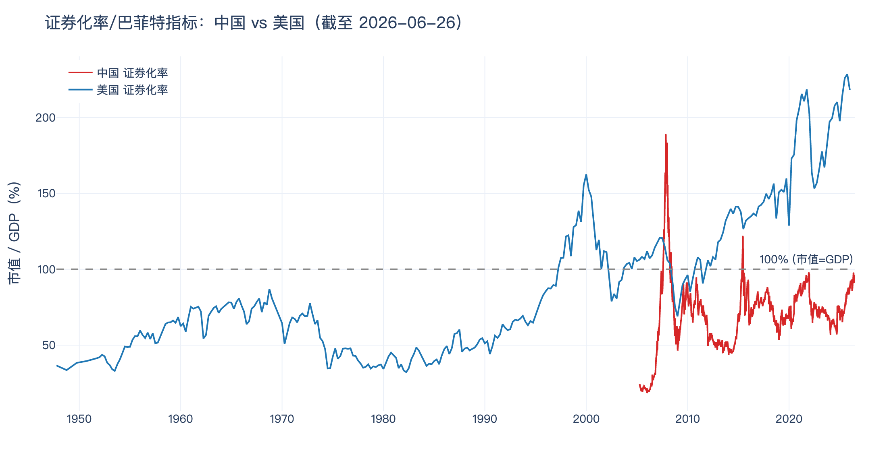
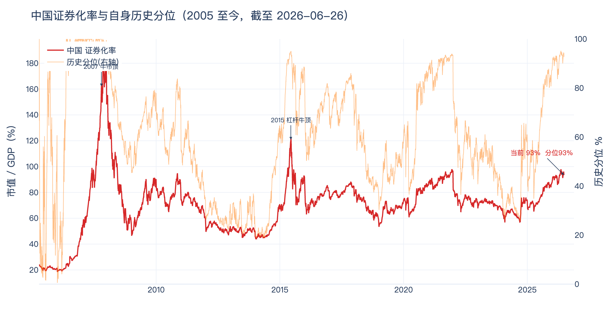

# 证券化率 / 巴菲特指标:中美对比与中国历史高位

> **证券化率(巴菲特指标)= 股市总市值 ÷ GDP**。巴菲特称其为"任何时点衡量股市估值最好的单一指标"。
> 数据截至 **2026-06-26**(中国每日)、**2026-Q1**(美国季度)。
> 数据源:中国 = akshare `stock_buffett_index_lg`(全市场总市值/GDP);美国 = FRED `NCBEILQ027S`(企业股权市值)÷ `GDP`。

---

## 一、一句话结论

- **中国 ≈ 93%**,**美国 ≈ 218%**,美国是中国的 **2.3 倍**。
- 但中国的 93% 已落在自身历史的 **92.7% 分位**——**对自己而言是高位**,只是绝对水平和美国不在一个量级。
- 所以同一个市场,**横向(对美国)便宜、纵向(对自己历史)偏贵**,这正是当前 A股估值的核心矛盾。

本文数据统计： 2026.6.27日生成的md文件，以及统计的数据。

---

## 二、关键数据

| 指标 | 中国 | 美国 |
|---|---|---|
| **当前证券化率** | **93.4%**(2026-06-26) | **218%**(2026-Q1) |
| 股市总市值 | 131.0 万亿元 | — |
| GDP | 140.2 万亿元(2025 全年) | $31.9 万亿 |
| 历史中位数 | 72% | 72% |
| 历史最高 | **189%**(2007-11) | **229%**(2025-10) |
| 历史最低 | 18%(2006-01) | — |
| 当前在自身历史的分位 | **92.7%(高位)** | ~99%(历史顶部) |

> 有意思的巧合:中美的**历史中位数都约 72%**。区别全在"现在站在历史的什么位置"——美国冲到了历史顶,中国是历史高位但远未破顶。

---

## 三、中美对比

**为什么美国能到 218%、中国只有 93%?** 不是简单的"美股贵、A股便宜",而是结构 + 统计口径差异:

| 维度 | 中国(压低证券化率) | 美国(抬高证券化率) |
|---|---|---|
| 最优质公司上市地 | 腾讯/阿里/美团/字节等在港股、美股或未上市,A股"装不下" | 全球最强公司全在美股,七巨头市值天量 |
| 上市公司营收来源 | 主要本土,和本土 GDP 匹配 | 苹果/微软等**全球营收**,但分母只算美国 GDP → 分母偏小、比值虚高 |
| 居民财富载体 | 主要在**房产**,没进股市 | 主要在**股票/基金**,直接进市值 |
| 市值结构 | 低 PB 银行/能源/制造为主(大量破净压制总市值) | 高估值科技为主 |

**含义:** 美国 218% 里有相当一部分是"全球公司装进美国分母"的统计放大,不能直接 1:1 和中国比。美国当前 ~218%、峰值 229%(2025-10),**显著高于互联网泡沫顶 163%(2000)**,处历史极端高位。

---

## 四、中国自身历史高位

把中国单独拎出来看:

- **2007 牛市顶:189%** ← 历史最高,真正的泡沫
- **2015 杠杆牛顶:122%**
- **历史中位:72%**
- **当前:93%,分位 92.7%**

也就是说,A股现在虽然离 2007/2015 那种泡沫顶还有距离(189% / 122% vs 93%),但**已经站在 2005 年以来约 93% 的高分位上**,明显贵于 72% 的历史中枢。配合上证指数 4100 点的价格高位,**估值处于"中性偏贵于自身均值、但未到泡沫"的区间**。

> ⚠️ 注意"点位 ≠ 估值":上证指数因编制问题长期失真,4100 点只说明价格涨了;真正衡量贵不贵的是这个证券化率/分位。

---

## 五、怎么用

1. **横向**别拿中国 93% 和美国 218% 直接比贵贱——口径不可比,美国偏高是结构性的。
2. **纵向**对中国更有意义:93% 分位意味着**安全边际在收窄**,不是遍地黄金的位置,但也不是 2007 那种系统性泡沫。
3. **盯两条线**:① 中国分位继续往 100% 走(逼近 2015)要警惕;② 美国 229% 历史顶若回落,通常拖累全球风险偏好。

---

*本文数据可在看板复现:`streamlit run quantlab/dashboard/app.py` → tab「📈 证券化率」。仅供研究,非投资建议。*
