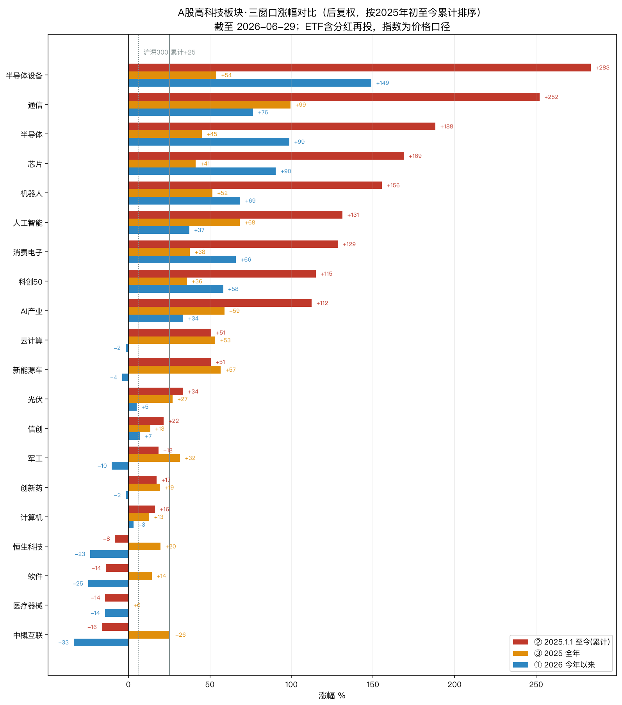
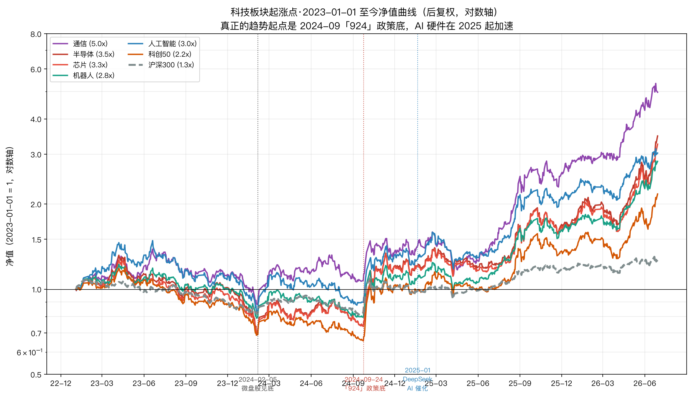

# A股高科技板块·三窗口涨幅对比与分析

> 数据截至 **2026-06-29**。口径：ETF 用**后复权**（含分红再投），指数（科创50 / 沪深300 / 中证机器人）为价格口径。
> 每段以**上一年末收盘价**为基准。复算脚本：`scripts/tech_sector_returns.py`。

三个窗口定义：

| 代号 | 窗口 | 基准日 → 结束日 |
|---|---|---|
| ① 今年以来 | 2026 年初至今 | 2025-12-31 收盘 → 最新 |
| ② 25.1.1 至今 | 2025 年初至今（累计） | 2024-12-31 收盘 → 最新 |
| ③ 2025 全年 | 自然年 2025 | 2024-12-31 收盘 → 2025-12-31 收盘 |

恒等式自洽：`(1+③)×(1+①) − 1 = ②`（已逐行核对，如通信 1.995×1.765−1 = +252%）。

---

## 一、总览图

*红=②累计 / 橙=③2025全年 / 蓝=①今年以来；灰线为沪深300（实线累计+25%，虚线今年以来+6%）。按累计涨幅排序。*

---

## 二、完整数据表（按②累计排序，分大类）

### 算力硬件链（今年的绝对主线）

| 板块 | 代表标的 | ① 今年以来 | ② 25.1.1至今 | ③ 2025全年 |
|---|---|---:|---:|---:|
| 半导体设备 | 159516 国泰 | **+149.0%** | **+283.4%** | +54.0% |
| 通信(含光模块) | 515050 华夏 | +76.5% | +252.1% | **+99.5%** |
| 半导体 | 512480 国联安 | +98.7% | +188.3% | +45.1% |
| 芯片 | 159995 华夏 | +90.4% | +169.0% | +41.3% |
| 消费电子 | 159732 华夏 | +65.9% | +128.6% | +37.8% |
| 科创50 | 指数 sh000688 | +58.2% | +115.0% | +35.9% |

### AI / 软件应用（2025 领涨，2026 熄火）

| 板块 | 代表标的 | ① 今年以来 | ② 25.1.1至今 | ③ 2025全年 |
|---|---|---:|---:|---:|
| 人工智能 | 159819 易方达 | +37.4% | +131.3% | +68.4% |
| AI产业 | 512930 平安 | +33.7% | +112.4% | +58.9% |
| 云计算 | 516510 易方达 | −1.7% | +50.8% | +53.3% |
| 信创 | 562030 华宝 | +7.3% | +21.6% | +13.4% |
| 计算机 | 512720 国泰 | +3.1% | +16.3% | +12.8% |
| 软件 | 515230 国泰 | **−24.7%** | −13.8% | +14.4% |

### 智能制造

| 板块 | 代表标的 | ① 今年以来 | ② 25.1.1至今 | ③ 2025全年 |
|---|---|---:|---:|---:|
| 机器人 | 中证机器人指数 | +68.6% | +155.5% | +51.5% |
| 新能源车 | 515030 华夏 | −3.9% | +50.6% | +56.6% |
| 光伏 | 515790 华泰柏瑞 | +5.1% | +33.6% | +27.1% |
| 军工 | 512660 国泰 | −10.1% | +18.4% | +31.8% |

### 医药 / 港股科技 / 基准

| 板块 | 代表标的 | ① 今年以来 | ② 25.1.1至今 | ③ 2025全年 |
|---|---|---:|---:|---:|
| 创新药 | 159992 银华 | −1.6% | +17.4% | +19.2% |
| 医疗器械 | 159883 永赢 | −14.4% | −14.2% | +0.2% |
| 恒生科技 | 513180 华夏 | −23.4% | −8.2% | +19.8% |
| 中概互联(≈KWEB) | 513050 易方达 | **−33.5%** | −16.3% | +25.8% |
| *沪深300（基准）* | 指数 sh000300 | +6.4% | +25.2% | +17.7% |

---

## 三、分析

### 1. 主线从「AI 应用普涨」轮动到「算力硬件独涨」，且宽度收窄

- **2025 全年（③）是普涨、且应用端领先**：通信 +99.5%、人工智能 +68.4%、AI产业 +58.9%、新能源车 +56.6%、云计算 +53.3%、机器人 +51.5% —— 应用/主题端 ≥ 硬件端（半导体 +45%、芯片 +41%）。当年是"沾 AI 就涨"。
- **2026 今年以来（①）画风突变**：领涨全部集中到**算力硬件** —— 半导体设备 +149%、半导体 +99%、芯片 +90%、通信 +76%、机器人 +69%、消费电子 +66%、科创50 +58%；而**应用端集体熄火甚至转负** —— 软件 −25%、新能源车 −4%、云计算 −2%、创新药 −2%、计算机 +3%，连"人工智能/AI产业"主题也只剩 +34~37%。
- 一句话：**钱从"讲 AI 故事的应用/软件"撤出，涌向"AI 的卖水人——芯片/设备/光模块"**，且参与板块越来越少。

### 2. 「买 AI」≠「买 AI」：硬件赢家通吃，软件最惨

同样挂"人工智能"招牌，今年以来：硬件（半导体设备 +149%、半导体 +99%、通信 +76%）VS 主题 ETF（人工智能 +37%、AI产业 +34%）VS 软件 −25%。差距最高接近 **180 个百分点**。
原因是后两者权重压在应用、算法、SaaS 公司上，没跟上"算力资本开支"这条今年唯一的主线。
**对持有"人工智能ETF / 软件ETF"的人是重要提醒**：你拿的并不是这轮涨最猛的那批资产。

### 3. 半导体设备 = 本轮"卖铲人"之王

三窗口全强，今年 +149% 居首、累计 +283%（已用中证半导体材料设备指数 +282% 交叉验证）。逻辑直接：晶圆厂/算力扩产 → 设备（北方华创、中微、拓荆等）最先、最确定地受益，强于下游芯片设计。

### 4. 港股 / 中概科技：与 A 股硬科技冰火两重天

2025 全年还不错（恒生科技 +19.8%、中概 +25.8%），但 **2026 以来塌方**（恒生科技 −23%、中概互联 −34%），全程跑输沪深300。资金在 A 股硬科技里抱团，**完全没有外溢到港股互联网**。中概互联（≈KWEB 同篮子，人民币口径）是全表今年最差。

### 5. "高科技"内部分化极大，不能一概而论

掉队名单：软件（全程最差）、医疗器械（两年几乎零收益）、新能源车/光伏（2025 涨完 2026 回吐）、军工（2025 +32% 但今年 −10%）、创新药（温吞）。沪深300 两年 +25%——**算力链跑赢基准 5~10 倍，而软件/医疗器械/港股科技反而跑输甚至为负**。这是结构性极端分化，不是"科技普涨"。

### 6. 与既有研判一致：抱团没扩散，反而更集中、且加速

今年领涨的（半导体设备、通信、半导体、芯片）恰是**两年累计涨幅最大的同一批**——抱团不但没向其他板块扩散，反而向少数硬件进一步收口、并加速。这正是温度计/拥挤度研判中记录的"AI/芯片抱团窄幅行情"的延续与强化，属于典型的**行情后段特征**（领涨集中、宽度收窄、应用与港股不跟）。

> 建议：用现有 `scripts/sector_crowding.py`、`scripts/turning_point.py` 持续盯**科创50 / 半导体 / 通信**的拥挤度与拐点信号——本轮涨幅与集中度都已到需要管理回撤的位置，而非追高的位置。

---

## 四、口径说明（回应"换不复权/全收益重算"）

**结论：必须用后复权（hfq），不复权（raw）在本批标的上会严重失真。**

- 绝大多数科技 ETF 几乎不分红，**后复权 ≈ 不复权（差≈0）**，两口径不影响结论。
- 但有 **4 只 ETF 在 2025–2026 做过份额折算（拆分）**，不复权序列出现单日 −48%~−74% 的**断点**（非真实下跌），导致不复权累计涨幅被打到极低甚至为负：

| 标的 | 折算日 | 当日 raw / hfq | ② 后复权 | ② 不复权(失真) |
|---|---|---|---:|---:|
| 通信 515050 | 2026-05-13 | −65.3% / +4.1% | +252.1% | +17.4% |
| 半导体设备 159516 | 2026-03-30 | −48.7% / +2.7% | +283.4% | +91.7% |
| AI产业 512930 | 2026-05-22 | −74.3% / +2.4% | +112.4% | −42.5% |
| 信创 562030 | 2025-09-15 | −50.0% / −0.1% | +21.6% | −39.2% |

- **后复权已用跟踪指数（拆分免疫）交叉验证**：半导体设备ETF +283% ≈ 中证半导体材料设备指数 +282%；人工智能ETF +131% ≈ 中证人工智能主题 +130%。两者高度吻合，证明后复权正确、不复权错误。
- 指数（科创50/沪深300/机器人）本身为价格口径（不含成份股分红）；若改用全收益指数，数值会再高几个百分点，但**不改变排序与结论**（A股分红率低，且科技股几乎不分红）。

---

## 五、起涨点：这轮到底从什么时候开始涨

**复算脚本：`scripts/tech_rally_start.py`。** 用自然年拆解 + 净值曲线定位起涨点。

### 5.1 年度拆解（按"自2023初累计"排序）

| 板块 | 2023全年 | 2024全年 | 2025全年 | 2026今年以来 | 自2024初累计 | 自2023初累计 | 全程最低点 |
|---|---:|---:|---:|---:|---:|---:|---|
| 通信 | +16.2% | +24.3% | +99.5% | +76.5% | +337.6% | **+408.5%** | 2024-02-05 |
| 半导体 | −2.4% | +25.5% | +45.1% | +98.7% | +261.8% | +253.0% | 2024-02-05 |
| 芯片 | −6.8% | +31.5% | +41.3% | +90.4% | +253.9% | +229.8% | 2024-02-05 |
| 人工智能 | +11.3% | +21.5% | +68.4% | +37.4% | +181.0% | +212.8% | 2024-02-05 |
| 消费电子 | +11.1% | +16.2% | +37.8% | +65.9% | +165.5% | +194.9% | 2024-02-05 |
| 机器人 | +0.8% | +11.5% | +51.5% | +68.6% | +184.9% | +187.2% | 2024-02-02 |
| AI产业 | +9.9% | +16.8% | +58.9% | +33.7% | +147.9% | +172.5% | 2024-02-05 |
| 科创50 | **−11.2%** | +16.1% | +35.9% | +58.2% | +149.5% | +121.5% | **2024-09-23** |
| 云计算 | +14.1% | +20.5% | +53.3% | −1.7% | +81.7% | +107.4% | 2024-02-05 |
| 沪深300 | −11.4% | +14.7% | +17.7% | +6.4% | +43.6% | +27.3% | 2024-09-13 |
| 计算机 | −2.2% | +10.4% | +12.8% | +3.1% | +28.4% | +25.7% | 2024-08-27 |
| 软件 | −2.0% | +1.8% | +14.4% | −24.7% | −12.2% | −14.0% | 2024-08-22 |
| 半导体设备 | — | +10.2% | +54.0% | +149.0% | +322.7% | — | 2024-02-05 |

### 5.2 三个关键时点（数据自证）

1. **绝对大底 = 2024-02-05**（微盘股/雪球崩盘日）。上表绝大多数板块"全程最低点"精确落在这天，此后再没回到那么低。
2. **真正的趋势起点 = 2024-09-24「924」政策底**。2024 年 2–9 月只是反弹后又磨底，科创50 甚至在 **2024-09-23 创了全程新低**（比 2 月还低）；924 跳空后才是单边上行（曲线上的断崖式跳升）。
3. **主升浪在 2025（DeepSeek 催化 AI）→ 2026 硬件加速**。2025 全年 + 2026 今年以来贡献了绝大部分涨幅。
4. **2023 不是起涨年**：科技整体在跌/磨底（半导体 −2.4%、芯片 −6.8%、科创50 −11.2%），只有 2023 年 3–6 月一波 AI 脉冲后全部回吐。

### 5.3 统计起点怎么选

- **推荐用 2024 年初（或更精确的「924」）**：绝对底就在 2024-02，此起点完整覆盖整个上涨段，又不掺 2023 的下跌噪音——衡量"这轮涨了多少"最干净。
- **从 2023 初**：适合看"一个完整周期（磨底→主升）"的总弹性（通信 +408%、半导体 +253%），但需明白前约 21 个月其实在跌。
- **从 2025 初**：只看最近的主升+加速段（本文档前三章口径）。
- 一句话：**这轮科技不是 2023 年涨的，是 2024 年 9 月「924」起步、2025 年放量、2026 年硬件加速的。**

---

## 六、投资建议

> 以下是基于上述数据的研判，非保证性建议；最终仓位需结合你自己的成本、持仓与风险承受度。具体怎么落地取决于你**现在是否已在车上、成本多少**。

### 6.1 行情阶段诊断：晚期 + 拥挤 + 窄幅

把三章证据合起来看，当前是一轮**已走了约两年、并在加速收口的趋势**：

- **领涨高度集中**到算力硬件（半导体设备累计 +283%、通信 +252%、半导体 +188%、芯片 +169%），且 **2026 还在加速**（半导体设备今年 +149%）；
- **宽度在塌**：软件今年 −25%、港股科技/中概 −23%/−34%、计算机 +3%、应用/软件端集体不跟；
- 这三条（**集中度上升 + 涨幅加速 + 宽度收窄**）是典型的**行情后段特征**，与库里"AI/芯片抱团窄幅、需管理回撤"的研判一致。

**含义：现在是"管理回撤"的位置，不是"追高加仓"的位置。** 这类高 beta 板块一旦反转，回吐 30–50% 很快。

### 6.2 分情况的具体姿态

**A. 已重仓持有（有浮盈）** —— 这是最可能的情形：
- **持有趋势，但分批兑现最陡的赢家**。半导体设备/通信今年 +149%/+76%，拥挤度与回撤风险都最高，对这两类**优先减、落袋**。
- **用机械信号驱动减仓，别靠盘感**：跑 `scripts/turning_point.py`（默认科创50）+ `scripts/sector_crowding.py` 盯**科创50/半导体/通信**的拐点与拥挤度，触发即按阶梯减，不预测顶。
- **留出现金缓冲**：这种斜率下必有急跌，留 20–30% 子弹等回撤再接，比满仓硬扛舒服得多。

**B. 空仓/轻仓想上车**：
- **不要在 +200~400% 累计、且今年还加速的硬件龙头上追高**——买在最拥挤、最陡的位置，赔率最差。
- 若一定要配，**等拐点/拥挤度降温后的回撤再分批建**，且单一硬科技主题**控制集中度**（如不超过权益仓的 30–40%）。

**C. 想做轮动/抄底落后板块**（软件、港股科技、医疗器械）：
- **谨慎**。这些是"看着便宜的下跌中标的"，**宽度尚未扩散**（应用/港股至今不跟），抄底等于赌"补涨"，胜率没有数据支撑。
- 真要分散，**用沪深300等宽基对冲**，而不是去接还在下跌的科技子板块。

### 6.3 一句话

**赔率已经不对称**：继续上行的空间（再走一段抛物线）有限且波动巨大，而向下均值回归的幅度可能很大。所以**整体姿态是"减、不是加"；用机械的拐点/拥挤度规则管住回撤，把这轮的利润真正落袋**——这与你温度计层"只控回撤、不追涨"的设计是一致的。

---

*生成：2026-06-29 ｜ 数据源：akshare（东财 ETF 后复权、新浪指数）｜ 复算：`python scripts/tech_sector_returns.py`、`python scripts/tech_rally_start.py`*
